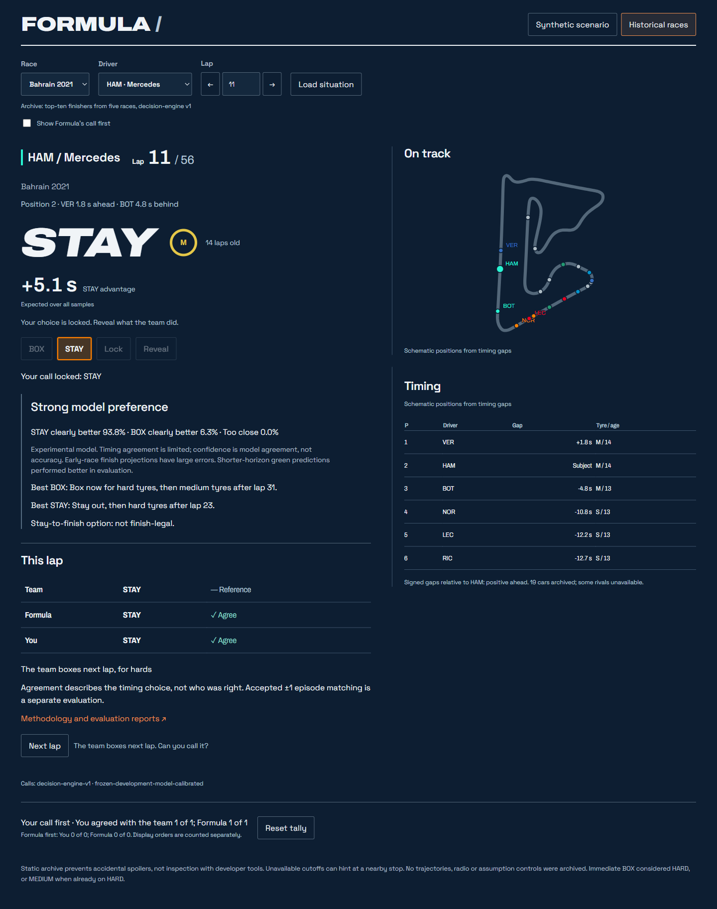

# Formula

An unofficial Formula 1 pit-wall strategy lab. Pick a real race moment, make your own BOX or STAY call, then compare it with a simulation engine and with what the team actually did.



## What you can do

- **Replay real decisions.** Historical mode covers five dry races: Bahrain 2021, Spain 2022, France 2022, Spain 2023 and Bahrain 2024. The archive contains 2,409 saved decisions for top-ten finishers, sampled every lap from lap 5 through scheduled race length minus five, subject to evaluation exclusions. Unavailable cutoffs show a generic message. Make your call, lock it, see Formula's call, then reveal the team's action. An optional toggle shows Formula first; session tallies keep the two modes separate.
- **Explore one decision in depth.** The synthetic scenario shows the call, two projected futures, a circuit map with the pit-stop rejoin point, and controls to test different assumptions.
- **Check the evidence.** Historical playback uses saved decision-engine-v1 outputs and causal state records, with no new engine runs. Outcome records are fetched only after Lock and Reveal. The version, methodology and evaluation reports are linked on the page.

The archive deliberately selects top-ten finishers. Missing cutoffs can hint at a nearby stop. Separate per-record files prevent accidental spoilers, but cannot prevent a determined user from opening outcomes with developer tools. See the [historical mode plan](docs/HISTORICAL_MODE_PLAN.md) and [UX report](docs/historical_ux/REPORT.md).

## How it works

For the original evaluation, Formula rebuilt the race state from FastF1 timing data at each cutoff. It simulated candidate strategies lap by lap to the finish, accounting for tyre wear estimated from completed clean laps, compound pace, pit-stop loss, traffic and sampled safety-car or virtual-safety-car risk. The call is the first action of the legal plan with the lowest expected race time. Dry-race weather uses observed conditions without a future forecast. Full details and frozen assumptions are in [MODEL.md](MODEL.md).

Inputs and fitted parameters exclude information after the cutoff, with one documented exception: a rival's crossing time for the same lap may be used as a labelled live-timing proxy. Rivals follow the engine's causal strategy assumptions rather than their actual future stops. Actual future plans and outcomes are evaluation labels, not decision inputs. Playback loads the selected saved record; it does not run FastF1 or the engine again.

The Python engine owns measurable facts and scores. Its architecture includes adapters, typed race state and provenance, deterministic Pace & Tyre, Weather and Race Control specialists, a Chief Strategist, semantic candidate IDs and auditable factor ownership. Separate selective LLM evidence/opinion/debate contracts reason over supplied evidence; fake providers exercise these in tests and historical playback needs no live-model credentials. The UI presents the results. See [src/](src/) for the implementation.

## How good is it?

Formula was developed on Bahrain 2021, Spain 2022 and France 2022, then tested once on Spain 2023 and Bahrain 2024 without changing the frozen model or calibration. On those unseen races, the **conditional green** predictions give:

| Prediction | Mean absolute elapsed-time error | Real result inside p10–p90 |
| --- | ---: | ---: |
| Next lap | 0.4 s | 82.1% |
| Next 5 laps | 2.0 s | 77.3% |
| Next 10 laps | 4.5 s | 75.2% |
| To the flag | 21 s | 67.6% |

These numbers average each race equally and include both stop and no-stop horizons. Conditional green means a green cutoff with no actual SC/VSC during the horizon, evaluated against samples without sampled neutralisation. The nominal interval target is 80%; it is not a guarantee. Exact values, full combined predictions and per-race/pit splits are in the [held-out comparison](docs/evaluation/held_out/COMPARISON.md).

One weak spot is finish projections **containing a future stop** from early and middle cutoffs. Their mean signed error was +44 s at laps 5–14 and +25 s at laps 15–29: too slow. This is not a statement about every long projection. The [saved-prediction diagnostic](docs/evaluation/held_out_finish_diagnostic/REPORT.md) refuted a dominant direct cliff-penalty explanation.

Box calls compared with teams, using one-to-one alert-episode matching within ±1 lap:

| Metric | Development races | Unseen races |
| --- | ---: | ---: |
| Formula box-alert episodes matched to a team stop (precision) | 21.7% | 46.9% |
| Observable team stops Formula also called (recall) | 8.5% | 37.5% |

These are pooled event counts, not equal-race averages or an accuracy score across all laps. Adjacent BOX calls collapse to an alert episode. The website instead compares BOX/STAY with the team's action **at that exact lap**, with a separate near-miss note. See the [agreement report](docs/evaluation/agreement/REPORT.md).

Formula calls far fewer stops than teams make. The disagreement analysis identifies observable contexts and structural limitations: immediate BOX considers HARD, or MEDIUM when already on HARD; the objective prioritises race time rather than track position; lap-boundary decisions cannot react immediately to mid-lap SC/VSC onset; and tyre priors are not season-specific. These motivate v2 work, but the tags do not prove causes or show which choice was better. Agreeing with a team is not the same as being right.

Reports: [prediction](docs/evaluation/held_out/REPORT.md), [agreement](docs/evaluation/agreement/REPORT.md), [disagreement](docs/evaluation/disagreement/REPORT.md). Protocols: [evaluation plan](docs/EVALUATION_PLAN.md), [agreement plan](docs/evaluation/AGREEMENT_PLAN.md), [disagreement protocol](docs/evaluation/disagreement/PROTOCOL.md).

The local frozen versions are `frozen-development-model`, `frozen-development-model-calibrated` and `decision-engine-v1`. Tag names do not imply they have been published to the remote.

## Roadmap

Phases 1–5 are complete and phase 6 historical mode is implemented; the linked roadmap still records its UI review as pending. Next is decision engine v2, targeting the four limitations above, with success criteria fixed before development and an untouched test on three reserved races: Italy 2023, Hungary 2024 and Bahrain 2025. The shared fail-closed acquisition gate protects these races until v2 is frozen, its test protocol is registered and acquisition is explicitly authorised. Wet races and the publication/methodology write-up follow later. See [docs/ROADMAP.md](docs/ROADMAP.md) and [the reservation policy](docs/evaluation/DENYLIST.md).

## Getting started

Run commands from the repository root containing `app.py`. The recommended reproducible setup uses **Python 3.11 and uv**, with the committed lockfile. Python metadata permits 3.10+, but setup was verified on Windows with Python 3.11.16 in an isolated environment using the same lockfile.

```powershell
uv sync --frozen --extra dev --python 3.11
```

Run the website, then open `http://127.0.0.1:8501`:

```powershell
.\.venv\Scripts\python.exe -m streamlit run app.py --server.address 127.0.0.1 --server.port 8501 --server.headless true --browser.gatherUsageStats false
```

The default page includes synthetic and historical modes. Its saved archive, fonts and track assets work locally without acquiring races. Static hosting uses the same relative record paths; see the [foundation report](docs/PHASE6_FOUNDATION_REPORT.md). The legacy dashboard is still accessible with `?view=legacy`.

Run the Python suite:

```powershell
.\.venv\Scripts\python.exe -m pytest tests/ -q
```

The locked Python 3.11 suite passed all 343 tests in this verification.

For browser tests, also install Node.js/npm and Google Chrome. The commands below were verified with Node 24.13.1 and Windows Chrome. Install Playwright under the ignored cache directory so browser dependencies are not added to Git:

```powershell
npm.cmd install --prefix data/cache/readme-browser --no-save --package-lock=false playwright
$env:NODE_PATH = Join-Path (Get-Location) 'data/cache/readme-browser/node_modules'
node --test tests/browser/historical.test.cjs tests/browser/circuit-map.test.cjs
```

Browser tests start local servers, verify reveal/network behaviour and synthetic-mode parity, and regenerate UX screenshots. On Windows they use Chrome at `C:/Program Files/Google/Chrome/Application/chrome.exe`; set `CHROME_PATH` if installed elsewhere. The browser suite passed all 18 tests in this verification.

An alternative unpinned setup (`python -m venv .venv`, activate it, then `python -m pip install -e ".[dev]"`) installed successfully with Python 3.12, but its Python suite had 342 passes and one exact floating-point fixture failure. Use the locked Python 3.11 setup for reproducibility; no model or test was changed to conceal that result.

## Repository layout

| Path | Contents |
| --- | --- |
| `app.py` | Streamlit entrypoint and static pit-wall wrapper. |
| `src/` | Input adapters, domain/provenance models, deterministic agents, projection calculators, orchestration, evaluation and legacy UI. |
| `design/` | Pit-wall HTML, CSS, JavaScript, bundled synthetic fixture and local fonts. |
| `static/` | Per-record causal/outcome archives, catalog, track assets and methodology copies served to the page. |
| `data/` | Track geometry, frozen profiles and race-access policy; generated FastF1 caches live in ignored `data/cache/`. |
| `docs/` | Roadmap, protocols, evaluation reports, historical-mode plans and screenshots. |
| `tests/` | Unit, tactical, cutoff/leakage, parity and browser tests with fixtures. |
| `tools/` | Acquisition, offline export/evaluation utilities and development orchestrator tooling. |
| `scripts/` | Track-geometry build script. |
| `.github/` | CI, security scanning and Dependabot configuration. |
| `.streamlit/` | Streamlit configuration, including static serving. |
| `pyproject.toml`, `uv.lock` | Package metadata and reproducible Python dependency resolution. |
| `MODEL.md`, `SECURITY.md` | Model assumptions/limitations and security policy. |

## Security and dependency hygiene

Keep FastF1 caches, virtual environments, API keys, `.env` files and Streamlit secrets out of Git. [`.gitignore`](.gitignore) excludes the cache directory and common local-secret paths; it does not remove already tracked files. Saved evaluation evidence and the website archive are separate from FastF1 caches.

CI is configured to run Python tests, Bandit and `pip-audit` on main pushes and pull requests. Its documented upstream dependency exception is visible in the [workflow](.github/workflows/ci.yml). Dependabot checks Python and GitHub Actions dependencies. See [SECURITY.md](SECURITY.md).

## Data, credits and disclaimer

Timing data is supplied via FastF1. The implementation uses Python, Pydantic, NumPy, pandas, Plotly and Streamlit; these dependencies retain their own licences.

The pit-wall page bundles and uses **Archivo** (upright and italic variable fonts) and **Space Grotesk**. Both are licensed under **SIL Open Font License 1.1**: [Archivo licence and credits](design/assets/fonts/Archivo-OFL.txt), [Space Grotesk licence and credits](design/assets/fonts/SpaceGrotesk-OFL.txt). Archivo is credited to the Archivo Project Authors; Space Grotesk to the Space Grotesk Project Authors.

There is currently **no repository-wide LICENSE file**. The font licences do not license the project code; no code licence has been added.

Formula is an unofficial experimental learning project and is not associated with Formula 1, the FIA, any team or FastF1. F1 and FORMULA 1 are trademarks of Formula One Licensing B.V. Live-model integration remains experimental; historical playback uses the saved scored engine, not live LLM advice.
