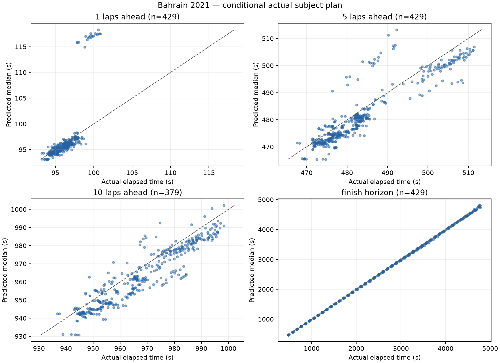
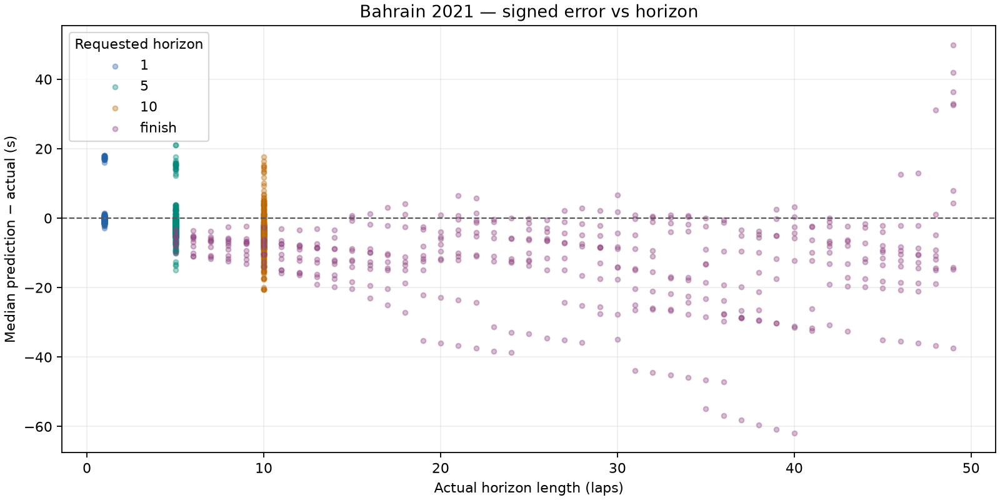

# Bahrain 2021: dry conditional prediction

Slice 1, development race only. No fitting, agreement/disagreement analysis or UI changes.

## Dataset and runtime

- Top ten: HAM, VER, BOT, NOR, PER, LEC, RIC, SAI, TSU, STR.
- Scheduled distance: 56 laps; cutoffs 5–51 inclusive; stride 1.
- Attempted snapshots: 470; evaluated: 429; excluded: 41.
- Scored predictions: 1666; excluded horizon targets: 50.
- Benchmark: 3 snapshots, mean 0.450s/snapshot; estimated full run 3.52 minutes.
- Actual evaluation loop: 257.60s. Every lap retained because estimated runtime was below 30 minutes.
- Entire evaluation ran with socket connections blocked; acquisition was a separate operation.

### Exclusions

| Scope | Reason | Count |
| --- | --- | ---: |
| snapshot | no_recent_clean_pace | 20 |
| snapshot | subject_stop_straddles_cutoff | 20 |
| snapshot | unknown_compound | 1 |
| target | target_beyond_finish_or_missing | 50 |

## Accuracy

Bias is predicted median minus actual elapsed time: negative means too fast. Coverage uses inclusive absolute p10–p90 endpoints; nominal target is 80%. Width is the mean p90 minus p10. Existing uncertainty is reported without post-result widening.

| Horizon | N | MAE (s) | Bias (s) | Coverage | Mean width (s) | Below p10 | Above p90 | Interval score (s) |
| --- | ---: | ---: | ---: | ---: | ---: | ---: | ---: | ---: |
| 1 | 429 | 1.337 | +0.397 | 6.1% | 0.219 | 79 | 324 | 12.445 |
| 5 | 429 | 3.823 | -1.972 | 5.1% | 0.959 | 56 | 351 | 33.999 |
| 10 | 379 | 6.139 | -4.554 | 4.2% | 1.648 | 57 | 306 | 54.442 |
| finish | 429 | 13.338 | -11.869 | 11.0% | 3.651 | 24 | 358 | 117.539 |

Coverage falls well short of 80% where the model's narrow pit/wear-only uncertainty fails to represent real pace variation. These are correlated snapshots from one development race, not an independent calibration result.





## Five worst predictions

Ranked across all scored horizons by absolute median error; several may come from the same driver or adjacent cutoffs.

| Driver | Cutoff | Target / horizon | Actual (s) | Median (s) | p10–p90 (s) | Error (s) |
| --- | ---: | --- | ---: | ---: | --- | ---: |
| HAM | 16 | 56 / finish | 3818.582 | 3756.624 | 3755.093–3759.373 | -61.958 |
| HAM | 17 | 56 / finish | 3723.483 | 3662.636 | 3661.103–3665.359 | -60.847 |
| HAM | 18 | 56 / finish | 3628.217 | 3568.660 | 3567.125–3571.348 | -59.557 |
| HAM | 19 | 56 / finish | 3532.871 | 3474.698 | 3473.160–3477.341 | -58.173 |
| HAM | 20 | 56 / finish | 3437.547 | 3380.748 | 3379.208–3383.338 | -56.799 |

1. **HAM, cutoff 16, finish:** Pace anchor: clean lap 15; fresh base 93.027s, cutoff tyre age 3; 1 future stop(s) in this horizon. Prediction is too fast. Long-horizon fixed wear/fuel and a minimum-clean-lap anchor can sustain more pace than the driver actually delivered. This is a model-based diagnostic, not proof of a single cause.

2. **HAM, cutoff 17, finish:** Pace anchor: clean lap 15; fresh base 92.977s, cutoff tyre age 4; 1 future stop(s) in this horizon. Prediction is too fast. Long-horizon fixed wear/fuel and a minimum-clean-lap anchor can sustain more pace than the driver actually delivered. This is a model-based diagnostic, not proof of a single cause.

3. **HAM, cutoff 18, finish:** Pace anchor: clean lap 15; fresh base 92.927s, cutoff tyre age 5; 1 future stop(s) in this horizon. Prediction is too fast. Long-horizon fixed wear/fuel and a minimum-clean-lap anchor can sustain more pace than the driver actually delivered. This is a model-based diagnostic, not proof of a single cause.

4. **HAM, cutoff 19, finish:** Pace anchor: clean lap 15; fresh base 92.877s, cutoff tyre age 6; 1 future stop(s) in this horizon. Prediction is too fast. Long-horizon fixed wear/fuel and a minimum-clean-lap anchor can sustain more pace than the driver actually delivered. This is a model-based diagnostic, not proof of a single cause.

5. **HAM, cutoff 20, finish:** Pace anchor: clean lap 15; fresh base 92.827s, cutoff tyre age 7; 1 future stop(s) in this horizon. Prediction is too fast. Long-horizon fixed wear/fuel and a minimum-clean-lap anchor can sustain more pace than the driver actually delivered. This is a model-based diagnostic, not proof of a single cause.

## Protocol and limitations

- Exact cutoff coordinates and actual elapsed labels use FastF1 corrected crossing Time. Pace/position/pit state uses only earlier raw TimingData packets; tyres use earlier TimingAppData updates. A LastLapTime received after the crossing is excluded until its packet arrives, even if this leaves the newest known pace one lap old.
- Gap exception: only rival same-lap crossing Time may follow cutoff, tagged live_timing_proxy_same_lap_crossing. Its other fields are never read. Missing crossings use a disclosed stale earlier common-lap gap. This is a retrospective crossing proxy, not a captured live gap feed.
- Session datetimes are epoch-encoded session-relative clocks, not asserted UTC wall times. Each snapshot saves exact cutoff seconds, source timestamps and parameter configuration.
- Frozen compound degradation scale 1, fuel 0.05s/lap, pit losses 21.5/12.5/9.5s, cliff/traffic/SC defaults. Fresh base pace reuses the minimum of the last six available clean laps, removing that anchor's nominal compound/wear cost and advancing its fuel effect to cutoff. No regression-based degradation or race fitting is used.
- Dry persistence, no forecast; seed 18, 32 shared samples, uniform pit offsets ±1.5s and wear multipliers ±15%. These do not include base-pace uncertainty, random traffic, damage, strategic lift-off, warm-up or future neutralizations.
- Actual subject stop schedule/compounds are supplied only AFTER constructing the snapshot, as conditional treatment. Autonomous subject stops are suppressed. Corrected full-session tyre labels are used only for this actual-plan treatment, never cutoff features. Rivals retain engine tyre-life stop assumptions, not observed future strategies.
- Pit-in lap K maps to boundary K−1; the engine charges the entire modeled stop loss on lap K and assumes fresh tyres there. Real losses span in/out laps; used replacement tyres are not modeled. Subject snapshots inside the pit are excluded.
- Fixed status persistence follows the existing engine. No actual future status is injected. Final classification selects subjects outside the engine (survivor bias). No held-out or wet races were acquired or evaluated by this slice.

## Reproduction

From the repository root, after acquiring the authorized race once:

```powershell
.\.venv\Scripts\python.exe -m tools.evaluate_bahrain
```

The command loads only the hash-verified local normalized cache, blocks network connections and regenerates this report. A missing/corrupt cache fails rather than downloading. Acquisition: `python -m tools.acquire_bahrain_evaluation` (Bahrain only).

- [Metrics](metrics.json), [predictions](predictions.csv), [exclusions](exclusions.json).
- [Manifest](manifest.json) records source/code hashes, versions, benchmark and defaults.
- Full state/config/plan audit: local ignored `data/cache/evaluation/bahrain_2021/snapshots.jsonl`.
