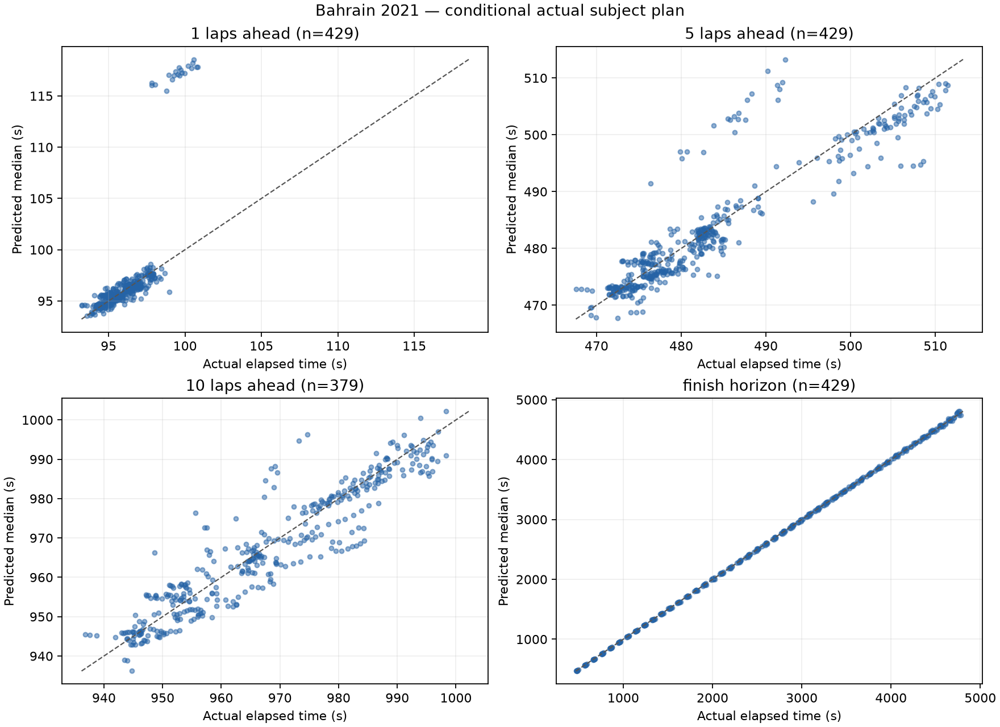
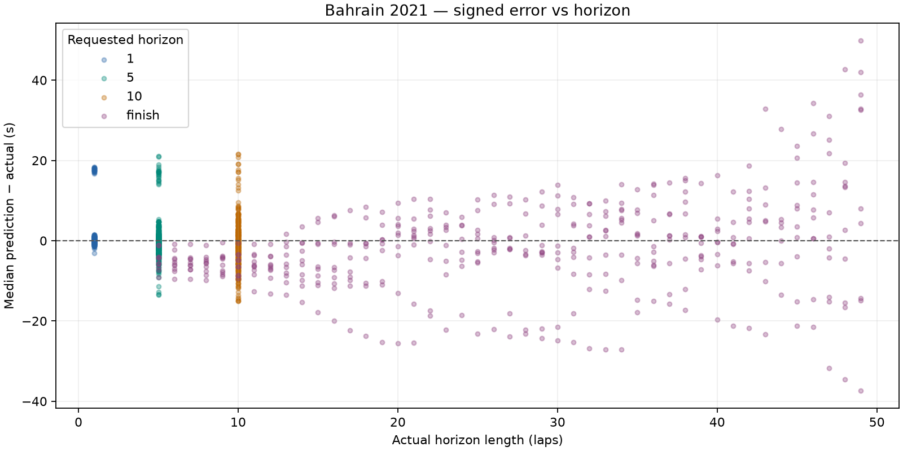

# Bahrain 2021: dry conditional prediction

Bahrain development race only. No race-wide fitting, agreement/disagreement analysis or UI changes.

Prediction source: fresh offline simulation. Previous comparison: docs\evaluation\bahrain_2021_diagnostics.

## Dataset and runtime

- Top ten: HAM, VER, BOT, NOR, PER, LEC, RIC, SAI, TSU, STR.
- Scheduled distance: 56 laps; cutoffs 5–51 inclusive; stride 1.
- Attempted snapshots: 470; evaluated: 429; excluded: 41.
- Scored predictions: 1666; excluded horizon targets: 50.
- Benchmark: 3 snapshots, mean 0.449s/snapshot; estimated full run 3.52 minutes.
- Actual evaluation loop: 250.22s. Every lap retained because estimated runtime was below 30 minutes.
- Entire evaluation ran with socket connections blocked; acquisition was a separate operation.

### Exclusions

| Scope | Reason | Count |
| --- | --- | ---: |
| snapshot | no_recent_clean_pace | 20 |
| snapshot | subject_stop_straddles_cutoff | 20 |
| snapshot | unknown_compound | 1 |
| target | target_beyond_finish_or_missing | 50 |

## Accuracy

Bias is predicted median minus actual elapsed time: negative means too fast. Coverage uses inclusive absolute p10–p90 endpoints; nominal target is 80%. Width is the mean p90 minus p10. Existing uncertainty is reported without post-result widening.

| Horizon | N | MAE (s) | Mean bias (s) | Median error (s) | Coverage | Mean width (s) | Below p10 | Above p90 | Interval score (s) |
| --- | ---: | ---: | ---: | ---: | ---: | ---: | ---: | ---: | ---: |
| 1 | 429 | 1.205 | +0.774 | -0.068 | 11.9% | 0.219 | 167 | 211 | 11.214 |
| 5 | 429 | 2.823 | -0.090 | -0.728 | 11.7% | 0.965 | 150 | 229 | 24.565 |
| 10 | 379 | 4.166 | -0.666 | -0.668 | 16.6% | 1.655 | 137 | 179 | 35.671 |
| finish | 429 | 8.413 | -1.687 | -2.342 | 15.9% | 3.636 | 140 | 221 | 71.119 |

## Median error, pit-stop split and error per lap

Signed error is predicted median minus actual. Pit-stop labels use actual subject pit-entry timestamps in (cutoff, target], solely as outcome diagnostics. All metrics are split by this label. Error/lap is computed for each prediction, then averaged or median-aggregated; finish horizons have different lengths.

| Horizon | Stops in horizon | N | MAE s | Mean bias s | Median error s | Mean error/lap s | Median error/lap s | MAE/lap s | Coverage | Mean width s | Below p10 | Above p90 | Interval score s |
| --- | --- | ---: | ---: | ---: | ---: | ---: | ---: | ---: | ---: | ---: | ---: | ---: | ---: |
| 1 | all | 429 | 1.205 | +0.774 | -0.068 | +0.774 | -0.068 | 1.205 | 11.9% | 0.219 | 167 | 211 | 11.214 |
| 1 | without_stop | 409 | 0.401 | -0.051 | -0.087 | -0.051 | -0.087 | 0.401 | 12.5% | 0.124 | 147 | 211 | 3.517 |
| 1 | with_stop | 20 | 17.652 | +17.652 | +17.721 | +17.652 | +17.721 | 17.652 | 0.0% | 2.162 | 20 | 0 | 168.623 |
| 5 | all | 429 | 2.823 | -0.090 | -0.728 | -0.018 | -0.146 | 0.565 | 11.7% | 0.965 | 150 | 229 | 24.565 |
| 5 | without_stop | 326 | 1.829 | -0.479 | -0.450 | -0.096 | -0.090 | 0.366 | 11.0% | 0.599 | 124 | 166 | 15.942 |
| 5 | with_stop | 103 | 5.968 | +1.140 | -1.871 | +0.228 | -0.374 | 1.194 | 13.6% | 2.123 | 26 | 63 | 51.858 |
| 10 | all | 379 | 4.166 | -0.666 | -0.668 | -0.067 | -0.067 | 0.417 | 16.6% | 1.655 | 137 | 179 | 35.671 |
| 10 | without_stop | 204 | 3.616 | -0.610 | -0.645 | -0.061 | -0.064 | 0.362 | 14.2% | 1.143 | 78 | 97 | 31.695 |
| 10 | with_stop | 175 | 4.808 | -0.732 | -0.727 | -0.073 | -0.073 | 0.481 | 19.4% | 2.252 | 59 | 82 | 40.306 |
| finish | all | 429 | 8.413 | -1.687 | -2.342 | -0.192 | -0.094 | 0.383 | 15.9% | 3.636 | 140 | 221 | 71.119 |
| finish | without_stop | 158 | 6.288 | -4.568 | -4.803 | -0.448 | -0.482 | 0.537 | 15.8% | 1.802 | 27 | 106 | 55.394 |
| finish | with_stop | 271 | 9.651 | -0.008 | +0.569 | -0.043 | +0.014 | 0.293 | 15.9% | 4.705 | 113 | 115 | 80.288 |

## Matched comparison with previous run

Same driver/cutoff/target cohort. Entries are previous → current; zero-sample pit-stop strata are unavailable. No outcome-derived tuning is applied.

| Horizon | Stops | N | Mean bias s | Median error s | MAE s | Coverage | Mean width s |
| --- | --- | ---: | --- | --- | --- | --- | --- |
| 1 | all | 429 | +0.397 → +0.774 | -0.428 → -0.068 | 1.337 → 1.205 | 6.1% → 11.9% | 0.219 → 0.219 |
| 1 | without_stop | 409 | -0.432 → -0.051 | -0.451 → -0.087 | 0.554 → 0.401 | 6.4% → 12.5% | 0.124 → 0.124 |
| 1 | with_stop | 20 | +17.354 → +17.652 | +17.379 → +17.721 | 17.354 → 17.652 | 0.0% → 0.0% | 2.162 → 2.162 |
| 5 | all | 429 | -1.972 → -0.090 | -2.614 → -0.728 | 3.823 → 2.823 | 5.1% → 11.7% | 0.959 → 0.965 |
| 5 | without_stop | 326 | -2.465 → -0.479 | -2.471 → -0.450 | 2.872 → 1.829 | 4.6% → 11.0% | 0.593 → 0.599 |
| 5 | with_stop | 103 | -0.411 → +1.140 | -3.791 → -1.871 | 6.834 → 5.968 | 6.8% → 13.6% | 2.118 → 2.123 |
| 10 | all | 379 | -4.554 → -0.666 | -4.670 → -0.668 | 6.139 → 4.166 | 4.2% → 16.6% | 1.648 → 1.655 |
| 10 | without_stop | 204 | -4.749 → -0.610 | -4.746 → -0.645 | 5.725 → 3.616 | 1.0% → 14.2% | 1.137 → 1.143 |
| 10 | with_stop | 175 | -4.327 → -0.732 | -4.643 → -0.727 | 6.621 → 4.808 | 8.0% → 19.4% | 2.243 → 2.252 |
| finish | all | 429 | -11.869 → -1.687 | -9.919 → -2.342 | 13.338 → 8.413 | 11.0% → 15.9% | 3.651 → 3.636 |
| finish | without_stop | 158 | -10.097 → -4.568 | -9.706 → -4.803 | 10.398 → 6.288 | 5.1% → 15.8% | 1.811 → 1.802 |
| finish | with_stop | 271 | -12.902 → -0.008 | -10.271 → +0.569 | 15.052 → 9.651 | 14.4% → 15.9% | 4.724 → 4.705 |

Coverage falls well short of 80% where the model's narrow pit/wear-only uncertainty fails to represent real pace variation. These are correlated snapshots from one development race, not an independent calibration result.





## Five worst predictions

Ranked across all scored horizons by absolute median error; several may come from the same driver or adjacent cutoffs.

| Driver | Cutoff | Target / horizon | Actual (s) | Median (s) | p10–p90 (s) | Error (s) |
| --- | ---: | --- | ---: | ---: | --- | ---: |
| LEC | 7 | 56 / finish | 4756.830 | 4806.681 | 4803.857–4810.207 | +49.851 |
| PER | 8 | 56 / finish | 4640.842 | 4683.527 | 4681.048–4687.118 | +42.685 |
| NOR | 7 | 56 / finish | 4743.546 | 4785.559 | 4782.171–4790.525 | +42.013 |
| STR | 7 | 56 / finish | 4780.939 | 4743.535 | 4740.491–4748.166 | -37.404 |
| TSU | 7 | 56 / finish | 4769.967 | 4806.361 | 4803.500–4809.698 | +36.394 |

1. **LEC, cutoff 7, finish:** Pace anchor: median, clean lap(s) [6]; fresh base 97.164s, cutoff tyre age 10; 2 future stop(s) in this horizon. Prediction is too slow. Fixed compound wear/cliff and the cutoff pace anchor can accumulate excessive cost over the horizon. This is a model-based diagnostic, not proof of a single cause.

2. **PER, cutoff 8, finish:** Pace anchor: median, clean lap(s) [6, 7]; fresh base 96.685s, cutoff tyre age 9; 2 future stop(s) in this horizon. Prediction is too slow. Fixed compound wear/cliff and the cutoff pace anchor can accumulate excessive cost over the horizon. This is a model-based diagnostic, not proof of a single cause.

3. **NOR, cutoff 7, finish:** Pace anchor: median, clean lap(s) [6]; fresh base 96.763s, cutoff tyre age 10; 2 future stop(s) in this horizon. Prediction is too slow. Fixed compound wear/cliff and the cutoff pace anchor can accumulate excessive cost over the horizon. This is a model-based diagnostic, not proof of a single cause.

4. **STR, cutoff 7, finish:** Pace anchor: median, clean lap(s) [6]; fresh base 95.916s, cutoff tyre age 10; 2 future stop(s) in this horizon. Prediction is too fast. Long-horizon fixed wear/fuel and the clean-lap anchor can sustain more pace than the driver actually delivered. This is a model-based diagnostic, not proof of a single cause.

5. **TSU, cutoff 7, finish:** Pace anchor: median, clean lap(s) [6]; fresh base 97.138s, cutoff tyre age 10; 2 future stop(s) in this horizon. Prediction is too slow. Fixed compound wear/cliff and the cutoff pace anchor can accumulate excessive cost over the horizon. This is a model-based diagnostic, not proof of a single cause.

## Protocol and limitations

- Exact cutoff coordinates and actual elapsed labels use FastF1 corrected crossing Time. Pace/position/pit state uses only earlier raw TimingData packets; tyres use earlier TimingAppData updates. A LastLapTime received after the crossing is excluded until its packet arrives, even if this leaves the newest known pace one lap old.
- Gap exception: only rival same-lap crossing Time may follow cutoff, tagged live_timing_proxy_same_lap_crossing. Its other fields are never read. Missing crossings use a disclosed stale earlier common-lap gap. This is a retrospective crossing proxy, not a captured live gap feed.
- Session datetimes are epoch-encoded session-relative clocks, not asserted UTC wall times. Each snapshot saves exact cutoff seconds, source timestamps and parameter configuration.
- Frozen compound degradation scale 1, fuel 0.05s/lap, pit losses 21.5/12.5/9.5s, cliff/traffic/SC defaults. Fresh base pace uses the median of the last six available clean laps, removing the central observation(s)' nominal compound/wear cost and advancing fuel effect to cutoff (minimum baseline uses its single fastest observation). No regression-based degradation or race-wide fitting is used.
- Dry persistence, no forecast; seed 18, 32 shared samples, uniform pit offsets ±1.5s and wear multipliers ±15%. These do not include base-pace uncertainty, random traffic, damage, strategic lift-off, warm-up or future neutralizations.
- Actual subject stop schedule/compounds are supplied only AFTER constructing the snapshot, as conditional treatment. Autonomous subject stops are suppressed. Corrected full-session tyre labels are used only for this actual-plan treatment, never cutoff features. Rivals retain engine tyre-life stop assumptions, not observed future strategies.
- Pit-in lap K maps to boundary K−1; the engine charges the entire modeled stop loss on lap K and assumes fresh tyres there. Real losses span in/out laps; used replacement tyres are not modeled. Subject snapshots inside the pit are excluded.
- Fixed status persistence follows the existing engine. No actual future status is injected. Final classification selects subjects outside the engine (survivor bias). No held-out or wet races were acquired or evaluated by this slice.

## Reproduction

From the repository root, after acquiring the authorized race once:

```powershell
.\.venv\Scripts\python.exe -m tools.evaluate_bahrain --output docs/evaluation/bahrain_2021_anchor_median --compare-to docs/evaluation/bahrain_2021_diagnostics
```

The command loads only the hash-verified local normalized cache, blocks network connections and regenerates this report. A missing/corrupt cache fails rather than downloading. Acquisition: `python -m tools.acquire_bahrain_evaluation` (Bahrain only).

- [Metrics](metrics.json), [predictions](predictions.csv), [exclusions](exclusions.json).
- [Manifest](manifest.json) records source/code hashes, versions, benchmark and defaults.
- Full state/config/plan audit: local ignored `data/cache/evaluation/bahrain_2021/snapshots_bahrain_2021_anchor_median.jsonl`.
