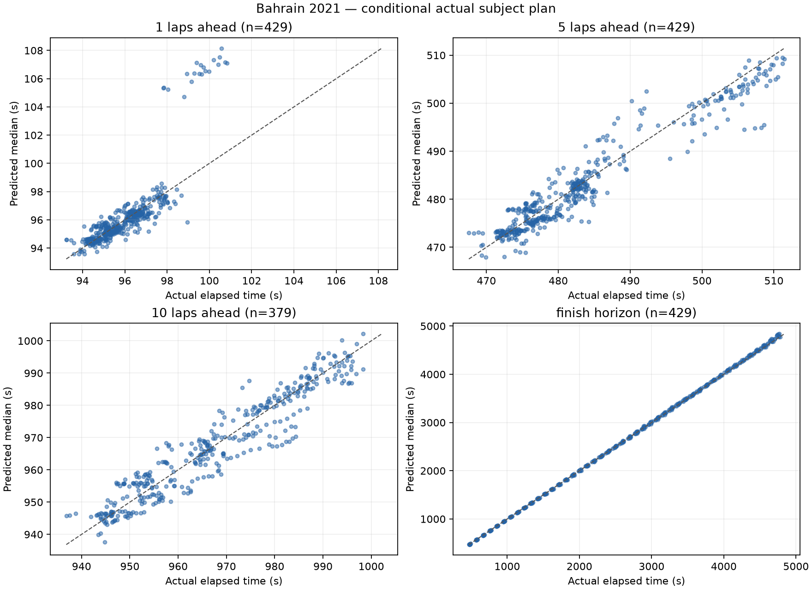
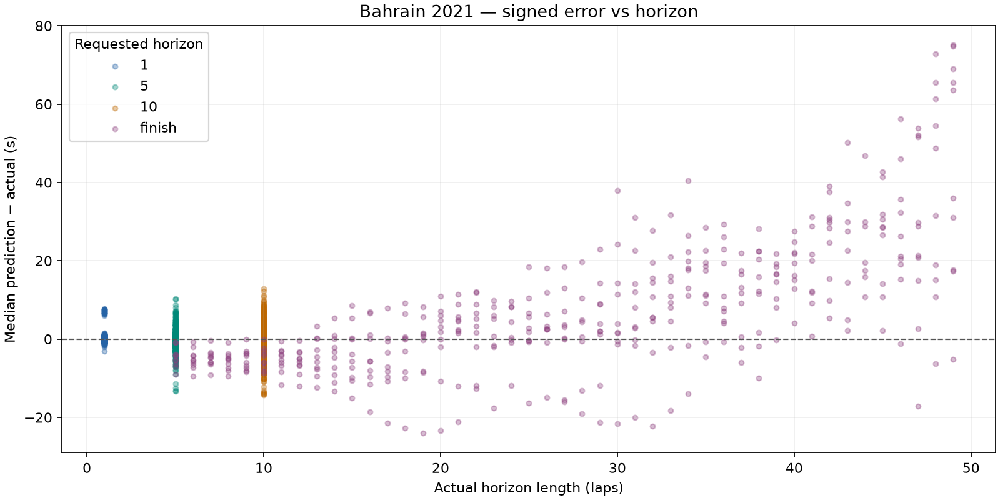

# Bahrain 2021: dry conditional prediction

Bahrain 2021 development race only. No race-wide fitting, agreement/disagreement analysis or UI changes.

Prediction source: fresh offline simulation. Previous comparison: docs\evaluation\bahrain_2021_ongoing.

## Dataset and runtime

- Top ten: HAM, VER, BOT, NOR, PER, LEC, RIC, SAI, TSU, STR.
- Scheduled distance: 56 laps; cutoffs 5-51 inclusive; stride 1.
- Attempted snapshots: 470; evaluated: 429; excluded: 41.
- Scored predictions: 1666; excluded horizon targets: 50.
- Benchmark: 3 snapshots, mean 0.515s/snapshot; estimated full run 4.03 minutes.
- Actual evaluation loop: 401.84s. Every lap retained because estimated runtime was below 30 minutes.
- Entire evaluation ran with socket connections blocked; acquisition was a separate operation.

### Exclusions

| Scope | Reason | Count |
| --- | --- | ---: |
| snapshot | no_recent_clean_pace | 20 |
| snapshot | subject_stop_straddles_cutoff | 20 |
| snapshot | unknown_compound | 1 |
| target | target_beyond_finish_or_missing | 50 |

## Accuracy

Bias is predicted median minus actual elapsed time: negative means too fast. Coverage uses inclusive absolute p10–p90 endpoints; nominal target is 80%. Width is the mean p90 minus p10. Existing uncertainty is reported without post-result widening.

| Horizon | N | MAE (s) | Mean bias (s) | Median error (s) | Coverage | Mean width (s) | Below p10 | Above p90 | Interval score (s) |
| --- | ---: | ---: | ---: | ---: | ---: | ---: | ---: | ---: | ---: |
| 1 | 429 | 0.709 | +0.260 | -0.087 | 61.3% | 1.020 | 78 | 88 | 5.207 |
| 5 | 429 | 2.265 | -0.402 | -0.582 | 49.9% | 3.715 | 81 | 134 | 14.350 |
| 10 | 379 | 3.818 | -0.245 | +0.106 | 78.4% | 35.290 | 82 | 0 | 41.525 |
| finish | 429 | 12.697 | +7.125 | +2.861 | 71.6% | 139.221 | 81 | 41 | 156.780 |

## Median error, pit-stop split and error per lap

Signed error is predicted median minus actual. Pit-stop labels use actual subject pit-entry timestamps in (cutoff, target], solely as outcome diagnostics. All metrics are split by this label. Error/lap is computed for each prediction, then averaged or median-aggregated; finish horizons have different lengths.

| Horizon | Stops in horizon | N | MAE s | Mean bias s | Median error s | Mean error/lap s | Median error/lap s | MAE/lap s | Coverage | Mean width s | Below p10 | Above p90 | Interval score s |
| --- | --- | ---: | ---: | ---: | ---: | ---: | ---: | ---: | ---: | ---: | ---: | ---: | ---: |
| 1 | all | 429 | 0.709 | +0.260 | -0.087 | +0.260 | -0.087 | 0.709 | 61.3% | 1.020 | 78 | 88 | 5.207 |
| 1 | without_stop | 409 | 0.402 | -0.068 | -0.106 | -0.068 | -0.106 | 0.402 | 64.3% | 1.004 | 58 | 88 | 2.325 |
| 1 | with_stop | 20 | 6.968 | +6.968 | +7.063 | +6.968 | +7.063 | 6.968 | 0.0% | 1.348 | 20 | 0 | 64.145 |
| 5 | all | 429 | 2.265 | -0.402 | -0.582 | -0.080 | -0.116 | 0.453 | 49.9% | 3.715 | 81 | 134 | 14.350 |
| 5 | without_stop | 326 | 1.826 | -0.291 | -0.205 | -0.058 | -0.041 | 0.365 | 55.5% | 3.692 | 56 | 89 | 10.803 |
| 5 | with_stop | 103 | 3.655 | -0.755 | -1.627 | -0.151 | -0.325 | 0.731 | 32.0% | 3.786 | 25 | 45 | 25.577 |
| 10 | all | 379 | 3.818 | -0.245 | +0.106 | -0.024 | +0.011 | 0.382 | 78.4% | 35.290 | 82 | 0 | 41.525 |
| 10 | without_stop | 204 | 3.639 | +0.126 | +0.136 | +0.013 | +0.014 | 0.364 | 77.0% | 35.417 | 47 | 0 | 42.539 |
| 10 | with_stop | 175 | 4.027 | -0.677 | +0.106 | -0.068 | +0.011 | 0.403 | 80.0% | 35.143 | 35 | 0 | 40.343 |
| finish | all | 429 | 12.697 | +7.125 | +2.861 | +0.053 | +0.103 | 0.475 | 71.6% | 139.221 | 81 | 41 | 156.780 |
| finish | without_stop | 158 | 5.965 | -3.340 | -4.134 | -0.370 | -0.408 | 0.503 | 69.0% | 68.725 | 13 | 36 | 79.535 |
| finish | with_stop | 271 | 16.622 | +13.226 | +11.175 | +0.300 | +0.323 | 0.459 | 73.1% | 180.321 | 68 | 5 | 201.816 |

## Matched comparison with previous run

Same driver/cutoff/target cohort. Entries are previous → current; zero-sample pit-stop strata are unavailable. No outcome-derived tuning is applied.

| Horizon | Stops | N | Mean bias s | Median error s | MAE s | Coverage | Mean width s |
| --- | --- | ---: | --- | --- | --- | --- | --- |
| 1 | all | 429 | +0.260 → +0.260 | -0.087 → -0.087 | 0.709 → 0.709 | 61.3% → 61.3% | 1.020 → 1.020 |
| 1 | without_stop | 409 | -0.068 → -0.068 | -0.106 → -0.106 | 0.402 → 0.402 | 64.3% → 64.3% | 1.004 → 1.004 |
| 1 | with_stop | 20 | +6.968 → +6.968 | +7.063 → +7.063 | 6.968 → 6.968 | 0.0% → 0.0% | 1.348 → 1.348 |
| 5 | all | 429 | -0.596 → -0.402 | -0.728 → -0.582 | 2.296 → 2.265 | 46.6% → 49.9% | 3.261 → 3.715 |
| 5 | without_stop | 326 | -0.483 → -0.291 | -0.506 → -0.205 | 1.841 → 1.826 | 52.8% → 55.5% | 3.239 → 3.692 |
| 5 | with_stop | 103 | -0.954 → -0.755 | -1.771 → -1.627 | 3.736 → 3.655 | 27.2% → 32.0% | 3.331 → 3.786 |
| 10 | all | 379 | -0.958 → -0.245 | -0.530 → +0.106 | 3.795 → 3.818 | 45.6% → 78.4% | 5.938 → 35.290 |
| 10 | without_stop | 204 | -0.577 → +0.126 | -0.528 → +0.136 | 3.617 → 3.639 | 47.5% → 77.0% | 6.040 → 35.417 |
| 10 | with_stop | 175 | -1.402 → -0.677 | -0.577 → +0.106 | 4.002 → 4.027 | 43.4% → 80.0% | 5.819 → 35.143 |
| finish | all | 429 | -1.458 → +7.125 | -2.185 → +2.861 | 8.519 → 12.697 | 47.6% → 71.6% | 15.763 → 139.221 |
| finish | without_stop | 158 | -4.573 → -3.340 | -4.883 → -4.134 | 6.315 → 5.965 | 32.3% → 69.0% | 7.302 → 68.725 |
| finish | with_stop | 271 | +0.358 → +13.226 | +0.664 → +11.175 | 9.804 → 16.622 | 56.5% → 73.1% | 20.696 → 180.321 |

Coverage remains below 80%; the model's uncertainty does not cover all real pace and pit timing variation. These are correlated snapshots from one development race, not an independent calibration result.





## Five worst predictions

Ranked across all scored horizons by absolute median error; several may come from the same driver or adjacent cutoffs.

| Driver | Cutoff | Target / horizon | Actual (s) | Median (s) | p10–p90 (s) | Error (s) |
| --- | ---: | --- | ---: | ---: | --- | ---: |
| NOR | 7 | 56 / finish | 4743.546 | 4818.617 | 4785.149–5016.786 | +75.071 |
| LEC | 7 | 56 / finish | 4756.830 | 4831.615 | 4805.110–5038.398 | +74.785 |
| LEC | 8 | 56 / finish | 4658.944 | 4731.722 | 4640.546–4916.890 | +72.778 |
| TSU | 7 | 56 / finish | 4769.967 | 4838.928 | 4805.021–5037.204 | +68.961 |
| NOR | 8 | 56 / finish | 4645.822 | 4711.367 | 4629.443–4897.567 | +65.545 |

1. **NOR, cutoff 7, finish:** Pace anchor: median, clean lap(s) [6]; fresh base 96.763s, cutoff tyre age 10; 2 future stop(s) in this horizon. Prediction is too slow. Fixed compound wear/cliff and the cutoff pace anchor can accumulate excessive cost over the horizon. This is a model-based diagnostic, not proof of a single cause.

2. **LEC, cutoff 7, finish:** Pace anchor: median, clean lap(s) [6]; fresh base 97.164s, cutoff tyre age 10; 2 future stop(s) in this horizon. Prediction is too slow. Fixed compound wear/cliff and the cutoff pace anchor can accumulate excessive cost over the horizon. This is a model-based diagnostic, not proof of a single cause.

3. **LEC, cutoff 8, finish:** Pace anchor: median, clean lap(s) [7, 6]; fresh base 96.506s, cutoff tyre age 11; 2 future stop(s) in this horizon. Prediction is too slow. Fixed compound wear/cliff and the cutoff pace anchor can accumulate excessive cost over the horizon. This is a model-based diagnostic, not proof of a single cause.

4. **TSU, cutoff 7, finish:** Pace anchor: median, clean lap(s) [6]; fresh base 97.138s, cutoff tyre age 10; 2 future stop(s) in this horizon. Prediction is too slow. Fixed compound wear/cliff and the cutoff pace anchor can accumulate excessive cost over the horizon. This is a model-based diagnostic, not proof of a single cause.

5. **NOR, cutoff 8, finish:** Pace anchor: median, clean lap(s) [7, 6]; fresh base 96.185s, cutoff tyre age 11; 2 future stop(s) in this horizon. Prediction is too slow. Fixed compound wear/cliff and the cutoff pace anchor can accumulate excessive cost over the horizon. This is a model-based diagnostic, not proof of a single cause.

## Protocol and limitations

- Exact cutoff coordinates and actual elapsed labels use FastF1 corrected crossing Time. Pace/position/pit state uses only earlier raw TimingData packets; tyres use earlier TimingAppData updates. A LastLapTime received after the crossing is excluded until its packet arrives, even if this leaves the newest known pace one lap old.
- Gap exception: only rival same-lap crossing Time may follow cutoff, tagged live_timing_proxy_same_lap_crossing. Its other fields are never read. Missing crossings use a disclosed stale earlier common-lap gap. This is a retrospective crossing proxy, not a captured live gap feed.
- Session datetimes are epoch-encoded session-relative clocks, not asserted UTC wall times. Each snapshot saves exact cutoff seconds, source timestamps and parameter configuration.
- Frozen compound degradation scale 1, fuel 0.05s/lap, pit losses 21.5/12.5/9.5s, cliff/traffic/SC defaults. Fresh base pace uses the median of the last six available clean laps, removing the central observation(s)' nominal compound/wear cost and advancing fuel effect to cutoff (minimum baseline uses its single fastest observation). No regression-based degradation or race-wide fitting is used.
- Dry persistence, no forecast; seed 18, 32 shared samples, uniform pit offsets +/-1.5s and wear multipliers +/-15%. Normal subject-only persistent pace offset (SD=s/sqrt(n)) and independent per-lap noise (SD=s), sized from the same driver's last six available clean laps after nominal wear/fuel corrections; antithetic paired draws, separate seed streams. One clean observation gives zero scatter. No error-based tuning. Future SC/VSC onset, duration and pace effects use the frozen 2019 prior. Random traffic, damage, strategic lift-off and warm-up remain unmodeled.
- Actual subject stop schedule/compounds are supplied only AFTER constructing the snapshot, as conditional treatment. Autonomous subject stops are suppressed. Corrected full-session tyre labels are used only for this actual-plan treatment, never cutoff features. Rivals retain engine tyre-life stop assumptions, not observed future strategies.
- Pit-in lap K maps to boundary K-1. A frozen 50/50 allocation charges half the sampled entry-time total on K and the remainder on K+1, for subject and modeled rival stops. A final-lap stop charges the whole total before finish. The share is an unestimated neutral default, not fitted to evaluation data. Fresh tyre timing remains the existing entry-lap approximation; used replacement tyres are not modeled. Subject snapshots inside the pit are excluded.
- Ongoing SC/VSC ends after an expected remaining duration conditioned on causal elapsed time, using the committed 2019 dry-race prior, never the actual ending. No later status is injected. Final classification selects subjects outside the engine (survivor bias). No held-out/wet evaluation is performed.

## Reproduction

From the repository root, after acquiring the authorized race once:

```powershell
.\.venv\Scripts\python.exe -m tools.evaluate_bahrain --output docs/evaluation/bahrain_2021_future --dataset data\cache\evaluation\bahrain_2021\session.json --compare-to docs\evaluation\bahrain_2021_ongoing
```

The command loads only the hash-verified local normalized cache, blocks network connections and regenerates this report. A missing/corrupt cache fails rather than downloading. Acquisition: `python -m tools.acquire_bahrain_evaluation --race bahrain_2021`.

- [Metrics](metrics.json), [predictions](predictions.csv), [exclusions](exclusions.json).
- [Manifest](manifest.json) records source/code hashes, versions, benchmark and defaults.
- Full state/config/plan audit: local ignored `data\cache\evaluation\bahrain_2021\snapshots_bahrain_2021_future.jsonl`.
