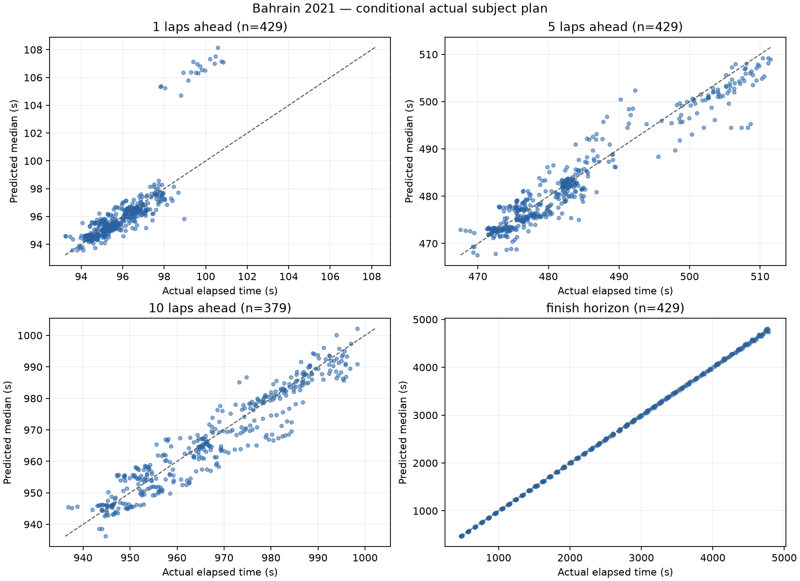
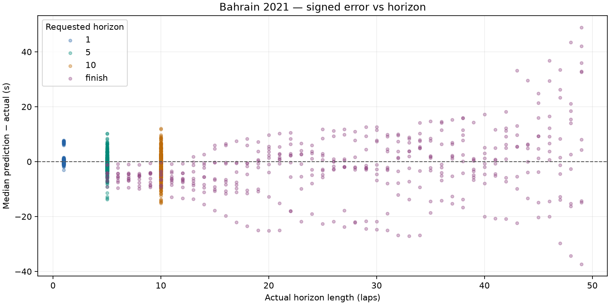

# Bahrain 2021: dry conditional prediction

Bahrain development race only. No race-wide fitting, agreement/disagreement analysis or UI changes.

Prediction source: fresh offline simulation. Previous comparison: docs\evaluation\bahrain_2021_uncertainty.

## Dataset and runtime

- Top ten: HAM, VER, BOT, NOR, PER, LEC, RIC, SAI, TSU, STR.
- Scheduled distance: 56 laps; cutoffs 5–51 inclusive; stride 1.
- Attempted snapshots: 470; evaluated: 429; excluded: 41.
- Scored predictions: 1666; excluded horizon targets: 50.
- Benchmark: 3 snapshots, mean 0.481s/snapshot; estimated full run 3.77 minutes.
- Actual evaluation loop: 279.84s. Every lap retained because estimated runtime was below 30 minutes.
- Entire evaluation ran with socket connections blocked; acquisition was a separate operation.

### Exclusions

| Scope | Reason | Count |
| --- | --- | ---: |
| snapshot | no_recent_clean_pace | 20 |
| snapshot | subject_stop_straddles_cutoff | 20 |
| snapshot | unknown_compound | 1 |
| target | target_beyond_finish_or_missing | 50 |

## Accuracy

Bias is predicted median minus actual elapsed time: negative means too fast. Coverage uses inclusive absolute p10–p90 endpoints; nominal target is 80%. Width is the mean p90 minus p10. Existing uncertainty is reported without post-result widening.

| Horizon | N | MAE (s) | Mean bias (s) | Median error (s) | Coverage | Mean width (s) | Below p10 | Above p90 | Interval score (s) |
| --- | ---: | ---: | ---: | ---: | ---: | ---: | ---: | ---: | ---: |
| 1 | 429 | 0.709 | +0.260 | -0.087 | 61.3% | 1.020 | 78 | 88 | 5.207 |
| 5 | 429 | 2.296 | -0.596 | -0.728 | 46.6% | 3.261 | 75 | 154 | 15.098 |
| 10 | 379 | 3.795 | -0.958 | -0.530 | 45.6% | 5.938 | 80 | 126 | 24.971 |
| finish | 429 | 8.519 | -1.458 | -2.185 | 47.6% | 15.763 | 57 | 168 | 51.740 |

## Median error, pit-stop split and error per lap

Signed error is predicted median minus actual. Pit-stop labels use actual subject pit-entry timestamps in (cutoff, target], solely as outcome diagnostics. All metrics are split by this label. Error/lap is computed for each prediction, then averaged or median-aggregated; finish horizons have different lengths.

| Horizon | Stops in horizon | N | MAE s | Mean bias s | Median error s | Mean error/lap s | Median error/lap s | MAE/lap s | Coverage | Mean width s | Below p10 | Above p90 | Interval score s |
| --- | --- | ---: | ---: | ---: | ---: | ---: | ---: | ---: | ---: | ---: | ---: | ---: | ---: |
| 1 | all | 429 | 0.709 | +0.260 | -0.087 | +0.260 | -0.087 | 0.709 | 61.3% | 1.020 | 78 | 88 | 5.207 |
| 1 | without_stop | 409 | 0.402 | -0.068 | -0.106 | -0.068 | -0.106 | 0.402 | 64.3% | 1.004 | 58 | 88 | 2.325 |
| 1 | with_stop | 20 | 6.968 | +6.968 | +7.063 | +6.968 | +7.063 | 6.968 | 0.0% | 1.348 | 20 | 0 | 64.145 |
| 5 | all | 429 | 2.296 | -0.596 | -0.728 | -0.119 | -0.146 | 0.459 | 46.6% | 3.261 | 75 | 154 | 15.098 |
| 5 | without_stop | 326 | 1.841 | -0.483 | -0.506 | -0.097 | -0.101 | 0.368 | 52.8% | 3.239 | 52 | 102 | 11.243 |
| 5 | with_stop | 103 | 3.736 | -0.954 | -1.771 | -0.191 | -0.354 | 0.747 | 27.2% | 3.331 | 23 | 52 | 27.299 |
| 10 | all | 379 | 3.795 | -0.958 | -0.530 | -0.096 | -0.053 | 0.379 | 45.6% | 5.938 | 80 | 126 | 24.971 |
| 10 | without_stop | 204 | 3.617 | -0.577 | -0.528 | -0.058 | -0.053 | 0.362 | 47.5% | 6.040 | 47 | 60 | 22.710 |
| 10 | with_stop | 175 | 4.002 | -1.402 | -0.577 | -0.140 | -0.058 | 0.400 | 43.4% | 5.819 | 33 | 66 | 27.606 |
| finish | all | 429 | 8.519 | -1.458 | -2.185 | -0.186 | -0.084 | 0.386 | 47.6% | 15.763 | 57 | 168 | 51.740 |
| finish | without_stop | 158 | 6.315 | -4.573 | -4.883 | -0.449 | -0.496 | 0.539 | 32.3% | 7.302 | 12 | 95 | 41.695 |
| finish | with_stop | 271 | 9.804 | +0.358 | +0.664 | -0.033 | +0.014 | 0.296 | 56.5% | 20.696 | 45 | 73 | 57.597 |

## Matched comparison with previous run

Same driver/cutoff/target cohort. Entries are previous → current; zero-sample pit-stop strata are unavailable. No outcome-derived tuning is applied.

| Horizon | Stops | N | Mean bias s | Median error s | MAE s | Coverage | Mean width s |
| --- | --- | ---: | --- | --- | --- | --- | --- |
| 1 | all | 429 | +0.759 → +0.260 | -0.087 → -0.087 | 1.208 → 0.709 | 61.3% → 61.3% | 1.063 → 1.020 |
| 1 | without_stop | 409 | -0.068 → -0.068 | -0.106 → -0.106 | 0.402 → 0.402 | 64.3% → 64.3% | 1.004 → 1.004 |
| 1 | with_stop | 20 | +17.683 → +6.968 | +17.773 → +7.063 | 17.683 → 6.968 | 0.0% → 0.0% | 2.264 → 1.348 |
| 5 | all | 429 | -0.071 → -0.596 | -0.728 → -0.728 | 2.823 → 2.296 | 46.6% → 46.6% | 3.279 → 3.261 |
| 5 | without_stop | 326 | -0.484 → -0.483 | -0.506 → -0.506 | 1.840 → 1.841 | 52.8% → 52.8% | 3.238 → 3.239 |
| 5 | with_stop | 103 | +1.238 → -0.954 | -1.821 → -1.771 | 5.935 → 3.736 | 27.2% → 27.2% | 3.411 → 3.331 |
| 10 | all | 379 | -0.586 → -0.958 | -0.530 → -0.530 | 4.165 → 3.795 | 45.1% → 45.6% | 5.940 → 5.938 |
| 10 | without_stop | 204 | -0.576 → -0.577 | -0.528 → -0.528 | 3.615 → 3.617 | 47.5% → 47.5% | 6.037 → 6.040 |
| 10 | with_stop | 175 | -0.598 → -1.402 | -0.577 → -0.577 | 4.807 → 4.002 | 42.3% → 43.4% | 5.827 → 5.819 |
| finish | all | 429 | -1.462 → -1.458 | -2.185 → -2.185 | 8.514 → 8.519 | 47.3% → 47.6% | 15.745 → 15.763 |
| finish | without_stop | 158 | -4.569 → -4.573 | -4.883 → -4.883 | 6.309 → 6.315 | 32.3% → 32.3% | 7.289 → 7.302 |
| finish | with_stop | 271 | +0.349 → +0.358 | +0.664 → +0.664 | 9.799 → 9.804 | 56.1% → 56.5% | 20.675 → 20.696 |

Coverage remains below 80%; the model's uncertainty does not cover all real pace and pit timing variation. These are correlated snapshots from one development race, not an independent calibration result.





## Five worst predictions

Ranked across all scored horizons by absolute median error; several may come from the same driver or adjacent cutoffs.

| Driver | Cutoff | Target / horizon | Actual (s) | Median (s) | p10–p90 (s) | Error (s) |
| --- | ---: | --- | ---: | ---: | --- | ---: |
| LEC | 7 | 56 / finish | 4756.830 | 4805.700 | 4803.057–4810.076 | +48.870 |
| PER | 8 | 56 / finish | 4640.842 | 4684.238 | 4662.148–4700.461 | +43.396 |
| NOR | 7 | 56 / finish | 4743.546 | 4785.559 | 4782.171–4790.525 | +42.013 |
| STR | 7 | 56 / finish | 4780.939 | 4743.535 | 4740.491–4748.166 | -37.404 |
| LEC | 10 | 56 / finish | 4462.759 | 4499.518 | 4468.028–4524.084 | +36.759 |

1. **LEC, cutoff 7, finish:** Pace anchor: median, clean lap(s) [6]; fresh base 97.164s, cutoff tyre age 10; 2 future stop(s) in this horizon. Prediction is too slow. Fixed compound wear/cliff and the cutoff pace anchor can accumulate excessive cost over the horizon. This is a model-based diagnostic, not proof of a single cause.

2. **PER, cutoff 8, finish:** Pace anchor: median, clean lap(s) [6, 7]; fresh base 96.685s, cutoff tyre age 9; 2 future stop(s) in this horizon. Prediction is too slow. Fixed compound wear/cliff and the cutoff pace anchor can accumulate excessive cost over the horizon. This is a model-based diagnostic, not proof of a single cause.

3. **NOR, cutoff 7, finish:** Pace anchor: median, clean lap(s) [6]; fresh base 96.763s, cutoff tyre age 10; 2 future stop(s) in this horizon. Prediction is too slow. Fixed compound wear/cliff and the cutoff pace anchor can accumulate excessive cost over the horizon. This is a model-based diagnostic, not proof of a single cause.

4. **STR, cutoff 7, finish:** Pace anchor: median, clean lap(s) [6]; fresh base 95.916s, cutoff tyre age 10; 2 future stop(s) in this horizon. Prediction is too fast. Long-horizon fixed wear/fuel and the clean-lap anchor can sustain more pace than the driver actually delivered. This is a model-based diagnostic, not proof of a single cause.

5. **LEC, cutoff 10, finish:** Pace anchor: median, clean lap(s) [8, 6]; fresh base 96.740s, cutoff tyre age 13; 2 future stop(s) in this horizon. Prediction is too slow. Fixed compound wear/cliff and the cutoff pace anchor can accumulate excessive cost over the horizon. This is a model-based diagnostic, not proof of a single cause.

## Protocol and limitations

- Exact cutoff coordinates and actual elapsed labels use FastF1 corrected crossing Time. Pace/position/pit state uses only earlier raw TimingData packets; tyres use earlier TimingAppData updates. A LastLapTime received after the crossing is excluded until its packet arrives, even if this leaves the newest known pace one lap old.
- Gap exception: only rival same-lap crossing Time may follow cutoff, tagged live_timing_proxy_same_lap_crossing. Its other fields are never read. Missing crossings use a disclosed stale earlier common-lap gap. This is a retrospective crossing proxy, not a captured live gap feed.
- Session datetimes are epoch-encoded session-relative clocks, not asserted UTC wall times. Each snapshot saves exact cutoff seconds, source timestamps and parameter configuration.
- Frozen compound degradation scale 1, fuel 0.05s/lap, pit losses 21.5/12.5/9.5s, cliff/traffic/SC defaults. Fresh base pace uses the median of the last six available clean laps, removing the central observation(s)' nominal compound/wear cost and advancing fuel effect to cutoff (minimum baseline uses its single fastest observation). No regression-based degradation or race-wide fitting is used.
- Dry persistence, no forecast; seed 18, 32 shared samples, uniform pit offsets +/-1.5s and wear multipliers +/-15%. Normal subject-only persistent pace offset (SD=s/sqrt(n)) and independent per-lap noise (SD=s), sized from the same driver's last six available clean laps after nominal wear/fuel corrections; antithetic paired draws, separate seed streams. One clean observation gives zero scatter. No error-based tuning. Random traffic, damage, strategic lift-off, warm-up and future neutralizations remain unmodeled.
- Actual subject stop schedule/compounds are supplied only AFTER constructing the snapshot, as conditional treatment. Autonomous subject stops are suppressed. Corrected full-session tyre labels are used only for this actual-plan treatment, never cutoff features. Rivals retain engine tyre-life stop assumptions, not observed future strategies.
- Pit-in lap K maps to boundary K-1. A frozen 50/50 allocation charges half the sampled entry-time total on K and the remainder on K+1, for subject and modeled rival stops. A final-lap stop charges the whole total before finish. The share is an unestimated neutral default, not fitted to evaluation data. Fresh tyre timing remains the existing entry-lap approximation; used replacement tyres are not modeled. Subject snapshots inside the pit are excluded.
- Fixed status persistence follows the existing engine. No actual future status is injected. Final classification selects subjects outside the engine (survivor bias). No held-out or wet races were acquired or evaluated by this slice.

## Reproduction

From the repository root, after acquiring the authorized race once:

```powershell
.\.venv\Scripts\python.exe -m tools.evaluate_bahrain --output docs/evaluation/bahrain_2021_pit_split --compare-to docs\evaluation\bahrain_2021_uncertainty
```

The command loads only the hash-verified local normalized cache, blocks network connections and regenerates this report. A missing/corrupt cache fails rather than downloading. Acquisition: `python -m tools.acquire_bahrain_evaluation` (Bahrain only).

- [Metrics](metrics.json), [predictions](predictions.csv), [exclusions](exclusions.json).
- [Manifest](manifest.json) records source/code hashes, versions, benchmark and defaults.
- Full state/config/plan audit: local ignored `data\cache\evaluation\bahrain_2021\snapshots_bahrain_2021_pit_split.jsonl`.
