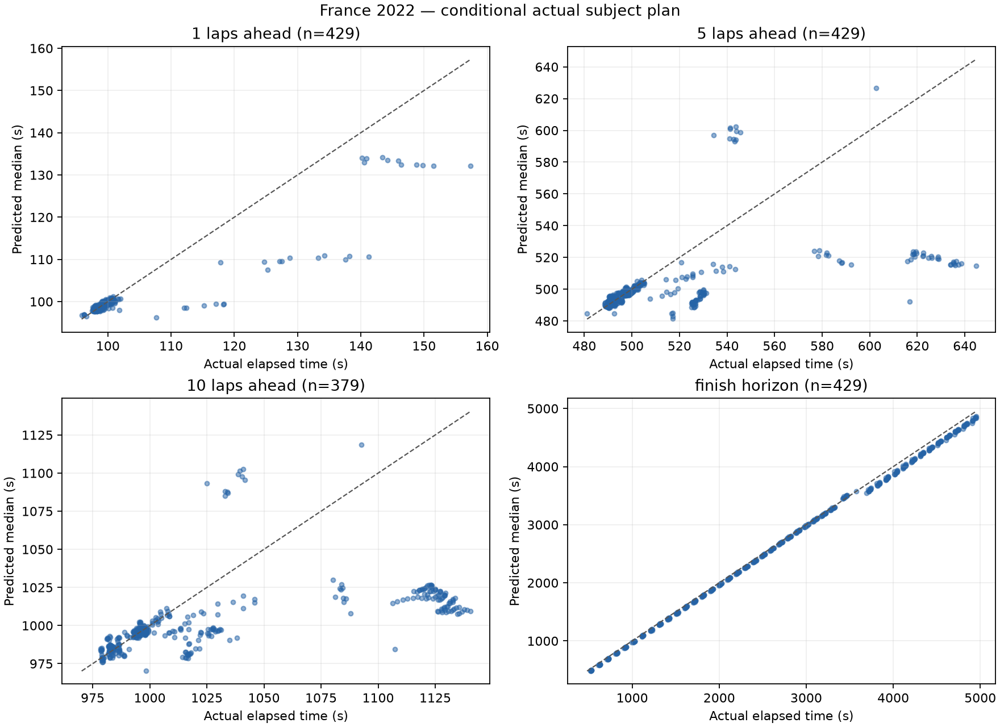
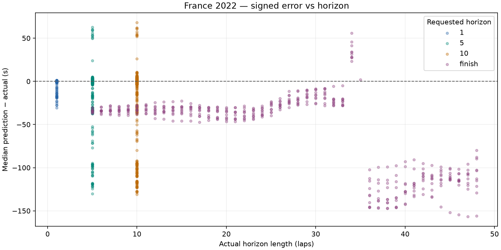

# France 2022: dry conditional prediction

France 2022 development race only. No race-wide fitting, agreement/disagreement analysis or UI changes.

Prediction source: fresh offline simulation. Previous comparison: docs\evaluation\france_2022_ongoing.

## Dataset and runtime

- Top ten: VER, HAM, RUS, PER, SAI, ALO, NOR, OCO, RIC, STR.
- Scheduled distance: 53 laps; cutoffs 5-48 inclusive; stride 1.
- Attempted snapshots: 440; evaluated: 429; excluded: 11.
- Scored predictions: 1666; excluded horizon targets: 50.
- Benchmark: 3 snapshots, mean 0.311s/snapshot; estimated full run 2.28 minutes.
- Actual evaluation loop: 220.25s. Every lap retained because estimated runtime was below 30 minutes.
- Entire evaluation ran with socket connections blocked; acquisition was a separate operation.

### Exclusions

| Scope | Reason | Count |
| --- | --- | ---: |
| snapshot | subject_stop_straddles_cutoff | 11 |
| target | target_beyond_finish_or_missing | 50 |

## Accuracy

Bias is predicted median minus actual elapsed time: negative means too fast. Coverage uses inclusive absolute p10–p90 endpoints; nominal target is 80%. Width is the mean p90 minus p10. Existing uncertainty is reported without post-result widening.

| Horizon | N | MAE (s) | Mean bias (s) | Median error (s) | Coverage | Mean width (s) | Below p10 | Above p90 | Interval score (s) |
| --- | ---: | ---: | ---: | ---: | ---: | ---: | ---: | ---: | ---: |
| 1 | 429 | 1.455 | -1.181 | -0.083 | 62.9% | 0.937 | 62 | 97 | 12.753 |
| 5 | 429 | 15.288 | -11.448 | -0.573 | 45.5% | 3.477 | 82 | 152 | 144.502 |
| 10 | 379 | 31.957 | -26.862 | -2.576 | 55.7% | 35.392 | 61 | 107 | 221.262 |
| finish | 429 | 57.359 | -55.723 | -34.581 | 85.1% | 140.470 | 10 | 54 | 181.476 |

## Median error, pit-stop split and error per lap

Signed error is predicted median minus actual. Pit-stop labels use actual subject pit-entry timestamps in (cutoff, target], solely as outcome diagnostics. All metrics are split by this label. Error/lap is computed for each prediction, then averaged or median-aggregated; finish horizons have different lengths.

| Horizon | Stops in horizon | N | MAE s | Mean bias s | Median error s | Mean error/lap s | Median error/lap s | MAE/lap s | Coverage | Mean width s | Below p10 | Above p90 | Interval score s |
| --- | --- | ---: | ---: | ---: | ---: | ---: | ---: | ---: | ---: | ---: | ---: | ---: | ---: |
| 1 | all | 429 | 1.455 | -1.181 | -0.083 | -1.181 | -0.083 | 1.455 | 62.9% | 0.937 | 62 | 97 | 12.753 |
| 1 | without_stop | 418 | 0.950 | -0.669 | -0.075 | -0.669 | -0.075 | 0.950 | 64.6% | 0.933 | 62 | 86 | 7.762 |
| 1 | with_stop | 11 | 20.664 | -20.664 | -18.451 | -20.664 | -18.451 | 20.664 | 0.0% | 1.083 | 0 | 11 | 202.391 |
| 5 | all | 429 | 15.288 | -11.448 | -0.573 | -2.290 | -0.115 | 3.058 | 45.5% | 3.477 | 82 | 152 | 144.502 |
| 5 | without_stop | 374 | 6.928 | -2.523 | -0.173 | -0.505 | -0.035 | 1.386 | 52.1% | 3.581 | 82 | 97 | 61.313 |
| 5 | with_stop | 55 | 72.138 | -72.138 | -94.720 | -14.428 | -18.944 | 14.428 | 0.0% | 2.766 | 0 | 55 | 710.187 |
| 10 | all | 379 | 31.957 | -26.862 | -2.576 | -2.686 | -0.258 | 3.196 | 55.7% | 35.392 | 61 | 107 | 221.262 |
| 10 | without_stop | 269 | 9.579 | -2.401 | -0.128 | -0.240 | -0.013 | 0.958 | 71.4% | 35.319 | 61 | 16 | 66.391 |
| 10 | with_stop | 110 | 86.682 | -86.682 | -99.939 | -8.668 | -9.994 | 8.668 | 17.3% | 35.572 | 0 | 91 | 599.994 |
| finish | all | 429 | 57.359 | -55.723 | -34.581 | -2.341 | -2.316 | 2.389 | 85.1% | 140.470 | 10 | 54 | 181.476 |
| finish | without_stop | 278 | 30.810 | -28.687 | -30.924 | -2.158 | -1.815 | 2.221 | 77.3% | 110.088 | 9 | 54 | 171.654 |
| finish | with_stop | 151 | 106.238 | -105.499 | -113.780 | -2.678 | -2.630 | 2.699 | 99.3% | 196.405 | 1 | 0 | 199.559 |

## Matched comparison with previous run

Same driver/cutoff/target cohort. Entries are previous → current; zero-sample pit-stop strata are unavailable. No outcome-derived tuning is applied.

| Horizon | Stops | N | Mean bias s | Median error s | MAE s | Coverage | Mean width s |
| --- | --- | ---: | --- | --- | --- | --- | --- |
| 1 | all | 429 | -0.614 → -1.181 | -0.063 → -0.083 | 1.583 → 1.455 | 62.9% → 62.9% | 0.917 → 0.937 |
| 1 | without_stop | 418 | -0.086 → -0.669 | -0.055 → -0.075 | 1.081 → 0.950 | 64.6% → 64.6% | 0.913 → 0.933 |
| 1 | with_stop | 11 | -20.664 → -20.664 | -18.451 → -18.451 | 20.664 → 20.664 | 0.0% → 0.0% | 1.083 → 1.083 |
| 5 | all | 429 | -8.665 → -11.448 | -0.745 → -0.573 | 18.264 → 15.288 | 41.7% → 45.5% | 3.017 → 3.477 |
| 5 | without_stop | 374 | +0.693 → -2.523 | -0.298 → -0.173 | 10.317 → 6.928 | 47.9% → 52.1% | 3.091 → 3.581 |
| 5 | with_stop | 55 | -72.301 → -72.138 | -95.092 → -94.720 | 72.301 → 72.138 | 0.0% → 0.0% | 2.519 → 2.766 |
| 10 | all | 379 | -24.129 → -26.862 | -3.165 → -2.576 | 35.500 → 31.957 | 31.4% → 55.7% | 5.161 → 35.392 |
| 10 | without_stop | 269 | +1.693 → -2.401 | -0.927 → -0.128 | 14.328 → 9.579 | 44.2% → 71.4% | 5.387 → 35.319 |
| 10 | with_stop | 110 | -87.274 → -86.682 | -100.351 → -99.939 | 87.274 → 86.682 | 0.0% → 17.3% | 4.609 → 35.572 |
| finish | all | 429 | -60.361 → -55.723 | -36.519 → -34.581 | 67.441 → 57.359 | 0.0% → 85.1% | 13.650 → 140.470 |
| finish | without_stop | 278 | -28.230 → -28.687 | -33.789 → -30.924 | 37.900 → 30.810 | 0.0% → 77.3% | 10.075 → 110.088 |
| finish | with_stop | 151 | -119.517 → -105.499 | -133.307 → -113.780 | 121.827 → 106.238 | 0.0% → 99.3% | 20.233 → 196.405 |

Coverage remains below 80%; the model's uncertainty does not cover all real pace and pit timing variation. These are correlated snapshots from one development race, not an independent calibration result.





## Five worst predictions

Ranked across all scored horizons by absolute median error; several may come from the same driver or adjacent cutoffs.

| Driver | Cutoff | Target / horizon | Actual (s) | Median (s) | p10–p90 (s) | Error (s) |
| --- | ---: | --- | ---: | ---: | --- | ---: |
| VER | 6 | 53 / finish | 4805.509 | 4648.777 | 4617.688–4834.838 | -156.732 |
| VER | 5 | 53 / finish | 4904.143 | 4748.395 | 4716.636–4947.655 | -155.748 |
| VER | 7 | 53 / finish | 4706.290 | 4551.927 | 4520.601–4738.331 | -154.363 |
| VER | 8 | 53 / finish | 4607.131 | 4455.166 | 4424.539–4638.212 | -151.965 |
| VER | 15 | 53 / finish | 3913.160 | 3766.091 | 3760.090–3936.356 | -147.069 |

1. **VER, cutoff 6, finish:** Pace anchor: median, clean lap(s) [2, 4]; fresh base 97.600s, cutoff tyre age 6; 1 future stop(s) in this horizon. Prediction is too fast. Long-horizon fixed wear/fuel and the clean-lap anchor can sustain more pace than the driver actually delivered. This is a model-based diagnostic, not proof of a single cause.

2. **VER, cutoff 5, finish:** Pace anchor: median, clean lap(s) [2]; fresh base 97.640s, cutoff tyre age 5; 1 future stop(s) in this horizon. Prediction is too fast. Long-horizon fixed wear/fuel and the clean-lap anchor can sustain more pace than the driver actually delivered. This is a model-based diagnostic, not proof of a single cause.

3. **VER, cutoff 7, finish:** Pace anchor: median, clean lap(s) [4]; fresh base 97.560s, cutoff tyre age 7; 1 future stop(s) in this horizon. Prediction is too fast. Long-horizon fixed wear/fuel and the clean-lap anchor can sustain more pace than the driver actually delivered. This is a model-based diagnostic, not proof of a single cause.

4. **VER, cutoff 8, finish:** Pace anchor: median, clean lap(s) [4, 6]; fresh base 97.612s, cutoff tyre age 8; 1 future stop(s) in this horizon. Prediction is too fast. Long-horizon fixed wear/fuel and the clean-lap anchor can sustain more pace than the driver actually delivered. This is a model-based diagnostic, not proof of a single cause.

5. **VER, cutoff 15, finish:** Pace anchor: median, clean lap(s) [12, 9]; fresh base 97.760s, cutoff tyre age 15; 1 future stop(s) in this horizon. Prediction is too fast. Long-horizon fixed wear/fuel and the clean-lap anchor can sustain more pace than the driver actually delivered. This is a model-based diagnostic, not proof of a single cause.

## Protocol and limitations

- Exact cutoff coordinates and actual elapsed labels use FastF1 corrected crossing Time. Pace/position/pit state uses only earlier raw TimingData packets; tyres use earlier TimingAppData updates. A LastLapTime received after the crossing is excluded until its packet arrives, even if this leaves the newest known pace one lap old.
- Gap exception: only rival same-lap crossing Time may follow cutoff, tagged live_timing_proxy_same_lap_crossing. Its other fields are never read. Missing crossings use a disclosed stale earlier common-lap gap. This is a retrospective crossing proxy, not a captured live gap feed.
- Session datetimes are epoch-encoded session-relative clocks, not asserted UTC wall times. Each snapshot saves exact cutoff seconds, source timestamps and parameter configuration.
- Frozen compound degradation scale 1, fuel 0.05s/lap, pit losses 21.5/12.5/9.5s, cliff/traffic/SC defaults. Fresh base pace uses the median of the last six available clean laps, removing the central observation(s)' nominal compound/wear cost and advancing fuel effect to cutoff (minimum baseline uses its single fastest observation). No regression-based degradation or race-wide fitting is used.
- Dry persistence, no forecast; seed 18, 32 shared samples, uniform pit offsets +/-1.5s and wear multipliers +/-15%. Normal subject-only persistent pace offset (SD=s/sqrt(n)) and independent per-lap noise (SD=s), sized from the same driver's last six available clean laps after nominal wear/fuel corrections; antithetic paired draws, separate seed streams. One clean observation gives zero scatter. No error-based tuning. Future SC/VSC onset, duration and pace effects use the frozen 2019 prior. Random traffic, damage, strategic lift-off and warm-up remain unmodeled.
- Actual subject stop schedule/compounds are supplied only AFTER constructing the snapshot, as conditional treatment. Autonomous subject stops are suppressed. Corrected full-session tyre labels are used only for this actual-plan treatment, never cutoff features. Rivals retain engine tyre-life stop assumptions, not observed future strategies.
- Pit-in lap K maps to boundary K-1. A frozen 50/50 allocation charges half the sampled entry-time total on K and the remainder on K+1, for subject and modeled rival stops. A final-lap stop charges the whole total before finish. The share is an unestimated neutral default, not fitted to evaluation data. Fresh tyre timing remains the existing entry-lap approximation; used replacement tyres are not modeled. Subject snapshots inside the pit are excluded.
- Ongoing SC/VSC ends after an expected remaining duration conditioned on causal elapsed time, using the committed 2019 dry-race prior, never the actual ending. No later status is injected. Final classification selects subjects outside the engine (survivor bias). No held-out/wet evaluation is performed.

## Reproduction

From the repository root, after acquiring the authorized race once:

```powershell
.\.venv\Scripts\python.exe -m tools.evaluate_bahrain --output docs/evaluation/france_2022_future --dataset data\cache\evaluation\france_2022\session.json --compare-to docs\evaluation\france_2022_ongoing
```

The command loads only the hash-verified local normalized cache, blocks network connections and regenerates this report. A missing/corrupt cache fails rather than downloading. Acquisition: `python -m tools.acquire_bahrain_evaluation --race france_2022`.

- [Metrics](metrics.json), [predictions](predictions.csv), [exclusions](exclusions.json).
- [Manifest](manifest.json) records source/code hashes, versions, benchmark and defaults.
- Full state/config/plan audit: local ignored `data\cache\evaluation\france_2022\snapshots_france_2022_future.jsonl`.
