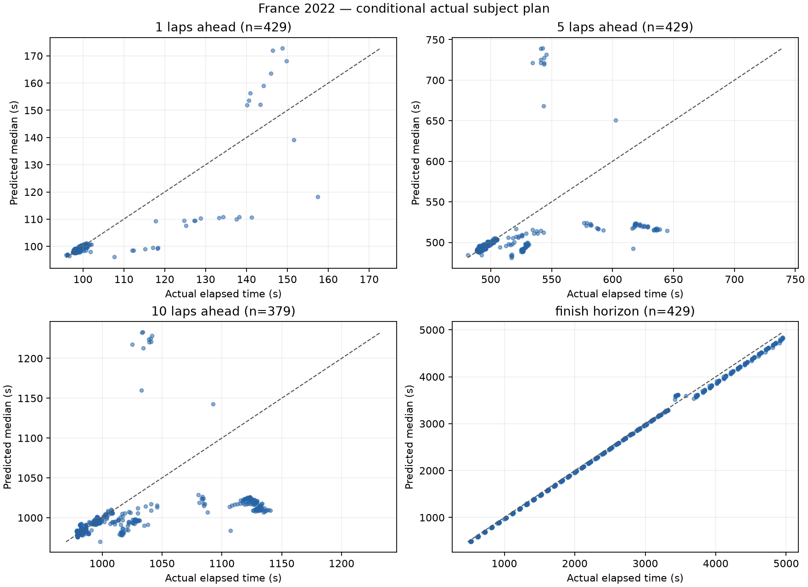
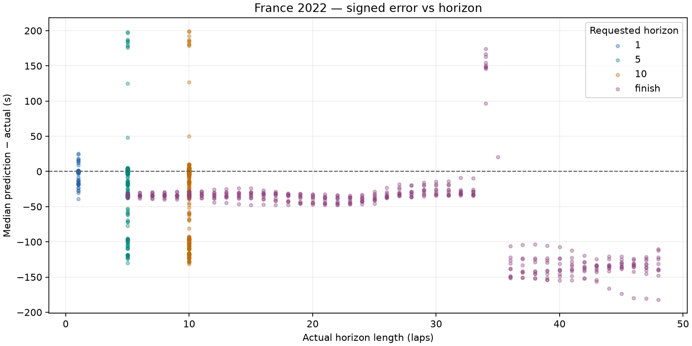

# France 2022: dry conditional prediction

France 2022 development race only. No race-wide fitting, agreement/disagreement analysis or UI changes.

Prediction source: fresh offline simulation. Previous comparison: docs\evaluation\france_2022_pit_split.

## Dataset and runtime

- Top ten: VER, HAM, RUS, PER, SAI, ALO, NOR, OCO, RIC, STR.
- Scheduled distance: 53 laps; cutoffs 5-48 inclusive; stride 1.
- Attempted snapshots: 440; evaluated: 429; excluded: 11.
- Scored predictions: 1666; excluded horizon targets: 50.
- Benchmark: 3 snapshots, mean 0.319s/snapshot; estimated full run 2.34 minutes.
- Actual evaluation loop: 245.47s. Every lap retained because estimated runtime was below 30 minutes.
- Entire evaluation ran with socket connections blocked; acquisition was a separate operation.

### Exclusions

| Scope | Reason | Count |
| --- | --- | ---: |
| snapshot | subject_stop_straddles_cutoff | 11 |
| target | target_beyond_finish_or_missing | 50 |

## Accuracy

Bias is predicted median minus actual elapsed time: negative means too fast. Coverage uses inclusive absolute p10–p90 endpoints; nominal target is 80%. Width is the mean p90 minus p10. Existing uncertainty is reported without post-result widening.

| Horizon | N | MAE (s) | Mean bias (s) | Median error (s) | Coverage | Mean width (s) | Below p10 | Above p90 | Interval score (s) |
| --- | ---: | ---: | ---: | ---: | ---: | ---: | ---: | ---: | ---: |
| 1 | 429 | 1.583 | -0.614 | -0.063 | 62.9% | 0.917 | 71 | 88 | 14.124 |
| 5 | 429 | 18.264 | -8.665 | -0.745 | 41.7% | 3.017 | 79 | 171 | 175.342 |
| 10 | 379 | 35.500 | -24.129 | -3.165 | 31.4% | 5.161 | 59 | 201 | 341.549 |
| finish | 429 | 67.441 | -60.361 | -36.519 | 0.0% | 13.650 | 11 | 418 | 619.846 |

## Median error, pit-stop split and error per lap

Signed error is predicted median minus actual. Pit-stop labels use actual subject pit-entry timestamps in (cutoff, target], solely as outcome diagnostics. All metrics are split by this label. Error/lap is computed for each prediction, then averaged or median-aggregated; finish horizons have different lengths.

| Horizon | Stops in horizon | N | MAE s | Mean bias s | Median error s | Mean error/lap s | Median error/lap s | MAE/lap s | Coverage | Mean width s | Below p10 | Above p90 | Interval score s |
| --- | --- | ---: | ---: | ---: | ---: | ---: | ---: | ---: | ---: | ---: | ---: | ---: | ---: |
| 1 | all | 429 | 1.583 | -0.614 | -0.063 | -0.614 | -0.063 | 1.583 | 62.9% | 0.917 | 71 | 88 | 14.124 |
| 1 | without_stop | 418 | 1.081 | -0.086 | -0.055 | -0.086 | -0.055 | 1.081 | 64.6% | 0.913 | 71 | 77 | 9.170 |
| 1 | with_stop | 11 | 20.664 | -20.664 | -18.451 | -20.664 | -18.451 | 20.664 | 0.0% | 1.083 | 0 | 11 | 202.391 |
| 5 | all | 429 | 18.264 | -8.665 | -0.745 | -1.733 | -0.149 | 3.653 | 41.7% | 3.017 | 79 | 171 | 175.342 |
| 5 | without_stop | 374 | 10.317 | +0.693 | -0.298 | +0.139 | -0.060 | 2.063 | 47.9% | 3.091 | 79 | 116 | 96.163 |
| 5 | with_stop | 55 | 72.301 | -72.301 | -95.092 | -14.460 | -19.018 | 14.460 | 0.0% | 2.519 | 0 | 55 | 713.756 |
| 10 | all | 379 | 35.500 | -24.129 | -3.165 | -2.413 | -0.316 | 3.550 | 31.4% | 5.161 | 59 | 201 | 341.549 |
| 10 | without_stop | 269 | 14.328 | +1.693 | -0.927 | +0.169 | -0.093 | 1.433 | 44.2% | 5.387 | 59 | 91 | 130.593 |
| 10 | with_stop | 110 | 87.274 | -87.274 | -100.351 | -8.727 | -10.035 | 8.727 | 0.0% | 4.609 | 0 | 110 | 857.432 |
| finish | all | 429 | 67.441 | -60.361 | -36.519 | -2.474 | -2.571 | 2.682 | 0.0% | 13.650 | 11 | 418 | 619.846 |
| finish | without_stop | 278 | 37.900 | -28.230 | -33.789 | -2.185 | -1.904 | 2.470 | 0.0% | 10.075 | 10 | 268 | 336.228 |
| finish | with_stop | 151 | 121.827 | -119.517 | -133.307 | -3.006 | -3.098 | 3.073 | 0.0% | 20.233 | 1 | 150 | 1142.003 |

## Matched comparison with previous run

Same driver/cutoff/target cohort. Entries are previous → current; zero-sample pit-stop strata are unavailable. No outcome-derived tuning is applied.

| Horizon | Stops | N | Mean bias s | Median error s | MAE s | Coverage | Mean width s |
| --- | --- | ---: | --- | --- | --- | --- | --- |
| 1 | all | 429 | -0.614 → -0.614 | -0.063 → -0.063 | 1.583 → 1.583 | 62.9% → 62.9% | 0.917 → 0.917 |
| 1 | without_stop | 418 | -0.086 → -0.086 | -0.055 → -0.055 | 1.081 → 1.081 | 64.6% → 64.6% | 0.913 → 0.913 |
| 1 | with_stop | 11 | -20.664 → -20.664 | -18.451 → -18.451 | 20.664 → 20.664 | 0.0% → 0.0% | 1.083 → 1.083 |
| 5 | all | 429 | -4.691 → -8.665 | -0.745 → -0.745 | 22.237 → 18.264 | 41.7% → 41.7% | 3.000 → 3.017 |
| 5 | without_stop | 374 | +5.251 → +0.693 | -0.298 → -0.298 | 14.875 → 10.317 | 47.9% → 47.9% | 3.071 → 3.091 |
| 5 | with_stop | 55 | -72.301 → -72.301 | -95.092 → -95.092 | 72.301 → 72.301 | 0.0% → 0.0% | 2.519 → 2.519 |
| 10 | all | 379 | -8.082 → -24.129 | -3.165 → -3.165 | 51.547 → 35.500 | 31.4% → 31.4% | 5.101 → 5.161 |
| 10 | without_stop | 269 | +24.302 → +1.693 | -0.927 → -0.927 | 36.937 → 14.328 | 44.2% → 44.2% | 5.302 → 5.387 |
| 10 | with_stop | 110 | -87.274 → -87.274 | -100.351 → -100.351 | 87.274 → 87.274 | 0.0% → 0.0% | 4.609 → 4.609 |
| finish | all | 429 | +2.818 → -60.361 | -36.519 → -36.519 | 130.620 → 67.441 | 0.0% → 0.0% | 13.467 → 13.650 |
| finish | without_stop | 278 | +59.746 → -28.230 | -33.789 → -33.789 | 125.876 → 37.900 | 0.0% → 0.0% | 9.809 → 10.075 |
| finish | with_stop | 151 | -101.989 → -119.517 | -133.307 → -133.307 | 139.354 → 121.827 | 0.0% → 0.0% | 20.201 → 20.233 |

Coverage remains below 80%; the model's uncertainty does not cover all real pace and pit timing variation. These are correlated snapshots from one development race, not an independent calibration result.





## Five worst predictions

Ranked across all scored horizons by absolute median error; several may come from the same driver or adjacent cutoffs.

| Driver | Cutoff | Target / horizon | Actual (s) | Median (s) | p10–p90 (s) | Error (s) |
| --- | ---: | --- | ---: | ---: | --- | ---: |
| RUS | 19 | 29 / 10 | 1033.047 | 1232.331 | 1231.175–1233.458 | +199.284 |
| PER | 19 | 29 / 10 | 1034.009 | 1232.925 | 1232.245–1233.488 | +198.916 |
| RUS | 19 | 24 / 5 | 540.962 | 738.897 | 738.567–739.273 | +197.935 |
| PER | 19 | 24 / 5 | 542.738 | 739.725 | 739.543–739.941 | +196.987 |
| SAI | 19 | 29 / 10 | 1024.975 | 1217.580 | 1216.535–1218.433 | +192.605 |

1. **RUS, cutoff 19, 10:** Safety car observed at cutoff; the engine ends it after the external prior's expected remaining duration conditional on its observed elapsed time. A real restart is not supplied as future input. This can dominate long-horizon error; it is not evidence of tyre wear. The pit allocation remains 50/50.

2. **PER, cutoff 19, 10:** Safety car observed at cutoff; the engine ends it after the external prior's expected remaining duration conditional on its observed elapsed time. A real restart is not supplied as future input. This can dominate long-horizon error; it is not evidence of tyre wear. The pit allocation remains 50/50.

3. **RUS, cutoff 19, 5:** Safety car observed at cutoff; the engine ends it after the external prior's expected remaining duration conditional on its observed elapsed time. A real restart is not supplied as future input. This can dominate long-horizon error; it is not evidence of tyre wear. The pit allocation remains 50/50.

4. **PER, cutoff 19, 5:** Safety car observed at cutoff; the engine ends it after the external prior's expected remaining duration conditional on its observed elapsed time. A real restart is not supplied as future input. This can dominate long-horizon error; it is not evidence of tyre wear. The pit allocation remains 50/50.

5. **SAI, cutoff 19, 10:** Safety car observed at cutoff; the engine ends it after the external prior's expected remaining duration conditional on its observed elapsed time. A real restart is not supplied as future input. This can dominate long-horizon error; it is not evidence of tyre wear. The pit allocation remains 50/50.

## Protocol and limitations

- Exact cutoff coordinates and actual elapsed labels use FastF1 corrected crossing Time. Pace/position/pit state uses only earlier raw TimingData packets; tyres use earlier TimingAppData updates. A LastLapTime received after the crossing is excluded until its packet arrives, even if this leaves the newest known pace one lap old.
- Gap exception: only rival same-lap crossing Time may follow cutoff, tagged live_timing_proxy_same_lap_crossing. Its other fields are never read. Missing crossings use a disclosed stale earlier common-lap gap. This is a retrospective crossing proxy, not a captured live gap feed.
- Session datetimes are epoch-encoded session-relative clocks, not asserted UTC wall times. Each snapshot saves exact cutoff seconds, source timestamps and parameter configuration.
- Frozen compound degradation scale 1, fuel 0.05s/lap, pit losses 21.5/12.5/9.5s, cliff/traffic/SC defaults. Fresh base pace uses the median of the last six available clean laps, removing the central observation(s)' nominal compound/wear cost and advancing fuel effect to cutoff (minimum baseline uses its single fastest observation). No regression-based degradation or race-wide fitting is used.
- Dry persistence, no forecast; seed 18, 32 shared samples, uniform pit offsets +/-1.5s and wear multipliers +/-15%. Normal subject-only persistent pace offset (SD=s/sqrt(n)) and independent per-lap noise (SD=s), sized from the same driver's last six available clean laps after nominal wear/fuel corrections; antithetic paired draws, separate seed streams. One clean observation gives zero scatter. No error-based tuning. Random traffic, damage, strategic lift-off, warm-up and future neutralizations remain unmodeled.
- Actual subject stop schedule/compounds are supplied only AFTER constructing the snapshot, as conditional treatment. Autonomous subject stops are suppressed. Corrected full-session tyre labels are used only for this actual-plan treatment, never cutoff features. Rivals retain engine tyre-life stop assumptions, not observed future strategies.
- Pit-in lap K maps to boundary K-1. A frozen 50/50 allocation charges half the sampled entry-time total on K and the remainder on K+1, for subject and modeled rival stops. A final-lap stop charges the whole total before finish. The share is an unestimated neutral default, not fitted to evaluation data. Fresh tyre timing remains the existing entry-lap approximation; used replacement tyres are not modeled. Subject snapshots inside the pit are excluded.
- Ongoing SC/VSC ends after an expected remaining duration conditioned on causal elapsed time, using the committed 2019 dry-race prior, never the actual ending. No later status is injected. Final classification selects subjects outside the engine (survivor bias). No held-out/wet evaluation is performed.

## Reproduction

From the repository root, after acquiring the authorized race once:

```powershell
.\.venv\Scripts\python.exe -m tools.evaluate_bahrain --output docs/evaluation/france_2022_ongoing --dataset data\cache\evaluation\france_2022\session.json --compare-to docs\evaluation\france_2022_pit_split
```

The command loads only the hash-verified local normalized cache, blocks network connections and regenerates this report. A missing/corrupt cache fails rather than downloading. Acquisition: `python -m tools.acquire_bahrain_evaluation --race france_2022`.

- [Metrics](metrics.json), [predictions](predictions.csv), [exclusions](exclusions.json).
- [Manifest](manifest.json) records source/code hashes, versions, benchmark and defaults.
- Full state/config/plan audit: local ignored `data\cache\evaluation\france_2022\snapshots_france_2022_ongoing.jsonl`.
