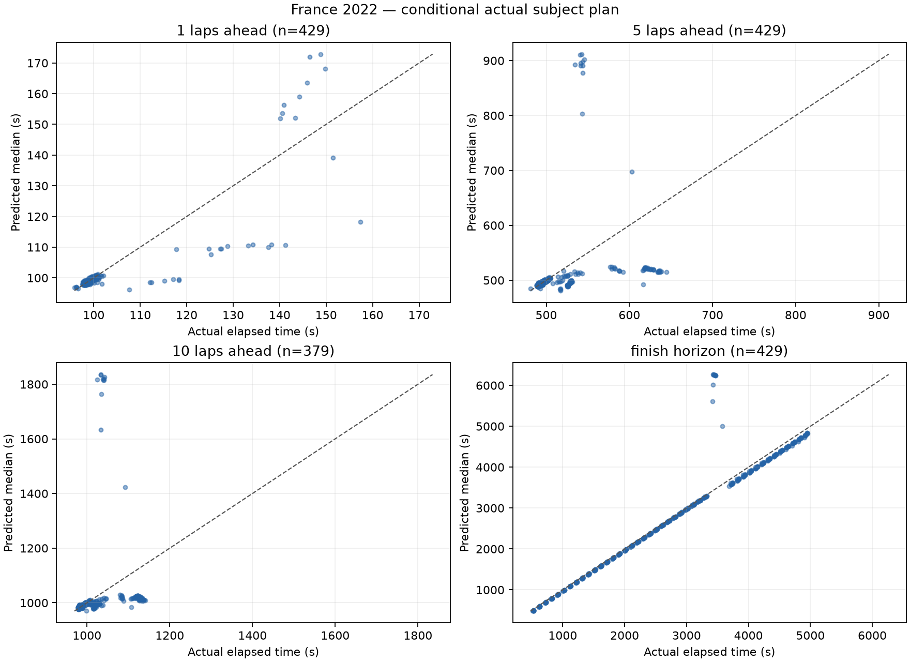
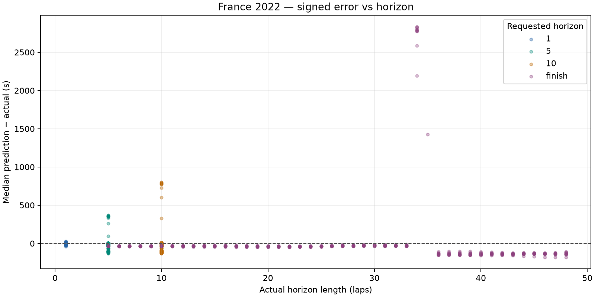

# France 2022: dry conditional prediction

France 2022 development race only. No race-wide fitting, agreement/disagreement analysis or UI changes.

Prediction source: fresh offline simulation. Previous comparison: none.

## Dataset and runtime

- Top ten: VER, HAM, RUS, PER, SAI, ALO, NOR, OCO, RIC, STR.
- Scheduled distance: 53 laps; cutoffs 5-48 inclusive; stride 1.
- Attempted snapshots: 440; evaluated: 429; excluded: 11.
- Scored predictions: 1666; excluded horizon targets: 50.
- Benchmark: 3 snapshots, mean 0.303s/snapshot; estimated full run 2.22 minutes.
- Actual evaluation loop: 243.16s. Every lap retained because estimated runtime was below 30 minutes.
- Entire evaluation ran with socket connections blocked; acquisition was a separate operation.

### Exclusions

| Scope | Reason | Count |
| --- | --- | ---: |
| snapshot | subject_stop_straddles_cutoff | 11 |
| target | target_beyond_finish_or_missing | 50 |

## Accuracy

Bias is predicted median minus actual elapsed time: negative means too fast. Coverage uses inclusive absolute p10–p90 endpoints; nominal target is 80%. Width is the mean p90 minus p10. Existing uncertainty is reported without post-result widening.

| Horizon | N | MAE (s) | Mean bias (s) | Median error (s) | Coverage | Mean width (s) | Below p10 | Above p90 | Interval score (s) |
| --- | ---: | ---: | ---: | ---: | ---: | ---: | ---: | ---: | ---: |
| 1 | 429 | 1.583 | -0.614 | -0.063 | 62.9% | 0.917 | 71 | 88 | 14.124 |
| 5 | 429 | 22.237 | -4.691 | -0.745 | 41.7% | 3.000 | 79 | 171 | 215.142 |
| 10 | 379 | 51.547 | -8.082 | -3.165 | 31.4% | 5.101 | 59 | 201 | 502.284 |
| finish | 429 | 130.620 | +2.818 | -36.519 | 0.0% | 13.467 | 11 | 418 | 1252.363 |

## Median error, pit-stop split and error per lap

Signed error is predicted median minus actual. Pit-stop labels use actual subject pit-entry timestamps in (cutoff, target], solely as outcome diagnostics. All metrics are split by this label. Error/lap is computed for each prediction, then averaged or median-aggregated; finish horizons have different lengths.

| Horizon | Stops in horizon | N | MAE s | Mean bias s | Median error s | Mean error/lap s | Median error/lap s | MAE/lap s | Coverage | Mean width s | Below p10 | Above p90 | Interval score s |
| --- | --- | ---: | ---: | ---: | ---: | ---: | ---: | ---: | ---: | ---: | ---: | ---: | ---: |
| 1 | all | 429 | 1.583 | -0.614 | -0.063 | -0.614 | -0.063 | 1.583 | 62.9% | 0.917 | 71 | 88 | 14.124 |
| 1 | without_stop | 418 | 1.081 | -0.086 | -0.055 | -0.086 | -0.055 | 1.081 | 64.6% | 0.913 | 71 | 77 | 9.170 |
| 1 | with_stop | 11 | 20.664 | -20.664 | -18.451 | -20.664 | -18.451 | 20.664 | 0.0% | 1.083 | 0 | 11 | 202.391 |
| 5 | all | 429 | 22.237 | -4.691 | -0.745 | -0.938 | -0.149 | 4.447 | 41.7% | 3.000 | 79 | 171 | 215.142 |
| 5 | without_stop | 374 | 14.875 | +5.251 | -0.298 | +1.050 | -0.060 | 2.975 | 47.9% | 3.071 | 79 | 116 | 141.817 |
| 5 | with_stop | 55 | 72.301 | -72.301 | -95.092 | -14.460 | -19.018 | 14.460 | 0.0% | 2.519 | 0 | 55 | 713.756 |
| 10 | all | 379 | 51.547 | -8.082 | -3.165 | -0.808 | -0.316 | 5.155 | 31.4% | 5.101 | 59 | 201 | 502.284 |
| 10 | without_stop | 269 | 36.937 | +24.302 | -0.927 | +2.430 | -0.093 | 3.694 | 44.2% | 5.302 | 59 | 91 | 357.055 |
| 10 | with_stop | 110 | 87.274 | -87.274 | -100.351 | -8.727 | -10.035 | 8.727 | 0.0% | 4.609 | 0 | 110 | 857.432 |
| finish | all | 429 | 130.620 | +2.818 | -36.519 | -0.619 | -2.571 | 4.538 | 0.0% | 13.467 | 11 | 418 | 1252.363 |
| finish | without_stop | 278 | 125.876 | +59.746 | -33.789 | +0.398 | -1.904 | 5.053 | 0.0% | 9.809 | 10 | 268 | 1217.000 |
| finish | with_stop | 151 | 139.354 | -101.989 | -133.307 | -2.490 | -3.098 | 3.589 | 0.0% | 20.201 | 1 | 150 | 1317.467 |

Coverage remains below 80%; the model's uncertainty does not cover all real pace and pit timing variation. These are correlated snapshots from one development race, not an independent calibration result.





## Five worst predictions

Ranked across all scored horizons by absolute median error; several may come from the same driver or adjacent cutoffs.

| Driver | Cutoff | Target / horizon | Actual (s) | Median (s) | p10–p90 (s) | Error (s) |
| --- | ---: | --- | ---: | ---: | --- | ---: |
| RUS | 19 | 53 / finish | 3429.208 | 6263.020 | 6261.369–6265.777 | +2833.812 |
| PER | 19 | 53 / finish | 3432.793 | 6263.944 | 6262.293–6266.701 | +2831.151 |
| SAI | 19 | 53 / finish | 3432.960 | 6254.026 | 6252.454–6257.301 | +2821.066 |
| ALO | 19 | 53 / finish | 3453.856 | 6254.610 | 6252.959–6257.367 | +2800.754 |
| NOR | 19 | 53 / finish | 3460.418 | 6250.060 | 6248.409–6252.817 | +2789.642 |

1. **RUS, cutoff 19, finish:** Safety car observed at cutoff; the unchanged engine persists that status through the projection and adds its frozen neutralized pace delay. A real restart is not supplied as future input. This can dominate long-horizon error; it is not evidence of tyre wear. The pit allocation remains 50/50.

2. **PER, cutoff 19, finish:** Safety car observed at cutoff; the unchanged engine persists that status through the projection and adds its frozen neutralized pace delay. A real restart is not supplied as future input. This can dominate long-horizon error; it is not evidence of tyre wear. The pit allocation remains 50/50.

3. **SAI, cutoff 19, finish:** Safety car observed at cutoff; the unchanged engine persists that status through the projection and adds its frozen neutralized pace delay. A real restart is not supplied as future input. This can dominate long-horizon error; it is not evidence of tyre wear. The pit allocation remains 50/50.

4. **ALO, cutoff 19, finish:** Safety car observed at cutoff; the unchanged engine persists that status through the projection and adds its frozen neutralized pace delay. A real restart is not supplied as future input. This can dominate long-horizon error; it is not evidence of tyre wear. The pit allocation remains 50/50.

5. **NOR, cutoff 19, finish:** Safety car observed at cutoff; the unchanged engine persists that status through the projection and adds its frozen neutralized pace delay. A real restart is not supplied as future input. This can dominate long-horizon error; it is not evidence of tyre wear. The pit allocation remains 50/50.

## Protocol and limitations

- Exact cutoff coordinates and actual elapsed labels use FastF1 corrected crossing Time. Pace/position/pit state uses only earlier raw TimingData packets; tyres use earlier TimingAppData updates. A LastLapTime received after the crossing is excluded until its packet arrives, even if this leaves the newest known pace one lap old.
- Gap exception: only rival same-lap crossing Time may follow cutoff, tagged live_timing_proxy_same_lap_crossing. Its other fields are never read. Missing crossings use a disclosed stale earlier common-lap gap. This is a retrospective crossing proxy, not a captured live gap feed.
- Session datetimes are epoch-encoded session-relative clocks, not asserted UTC wall times. Each snapshot saves exact cutoff seconds, source timestamps and parameter configuration.
- Frozen compound degradation scale 1, fuel 0.05s/lap, pit losses 21.5/12.5/9.5s, cliff/traffic/SC defaults. Fresh base pace uses the median of the last six available clean laps, removing the central observation(s)' nominal compound/wear cost and advancing fuel effect to cutoff (minimum baseline uses its single fastest observation). No regression-based degradation or race-wide fitting is used.
- Dry persistence, no forecast; seed 18, 32 shared samples, uniform pit offsets +/-1.5s and wear multipliers +/-15%. Normal subject-only persistent pace offset (SD=s/sqrt(n)) and independent per-lap noise (SD=s), sized from the same driver's last six available clean laps after nominal wear/fuel corrections; antithetic paired draws, separate seed streams. One clean observation gives zero scatter. No error-based tuning. Random traffic, damage, strategic lift-off, warm-up and future neutralizations remain unmodeled.
- Actual subject stop schedule/compounds are supplied only AFTER constructing the snapshot, as conditional treatment. Autonomous subject stops are suppressed. Corrected full-session tyre labels are used only for this actual-plan treatment, never cutoff features. Rivals retain engine tyre-life stop assumptions, not observed future strategies.
- Pit-in lap K maps to boundary K-1. A frozen 50/50 allocation charges half the sampled entry-time total on K and the remainder on K+1, for subject and modeled rival stops. A final-lap stop charges the whole total before finish. The share is an unestimated neutral default, not fitted to evaluation data. Fresh tyre timing remains the existing entry-lap approximation; used replacement tyres are not modeled. Subject snapshots inside the pit are excluded.
- Fixed status persistence follows the existing engine. No actual future status is injected. Final classification selects subjects outside the engine (survivor bias). No held-out or wet races were acquired or evaluated by this slice.

## Reproduction

From the repository root, after acquiring the authorized race once:

```powershell
.\.venv\Scripts\python.exe -m tools.evaluate_bahrain --output docs/evaluation/france_2022_pit_split --dataset data\cache\evaluation\france_2022\session.json
```

The command loads only the hash-verified local normalized cache, blocks network connections and regenerates this report. A missing/corrupt cache fails rather than downloading. Acquisition: `python -m tools.acquire_bahrain_evaluation --race france_2022`.

- [Metrics](metrics.json), [predictions](predictions.csv), [exclusions](exclusions.json).
- [Manifest](manifest.json) records source/code hashes, versions, benchmark and defaults.
- Full state/config/plan audit: local ignored `data\cache\evaluation\france_2022\snapshots_france_2022_pit_split.jsonl`.
