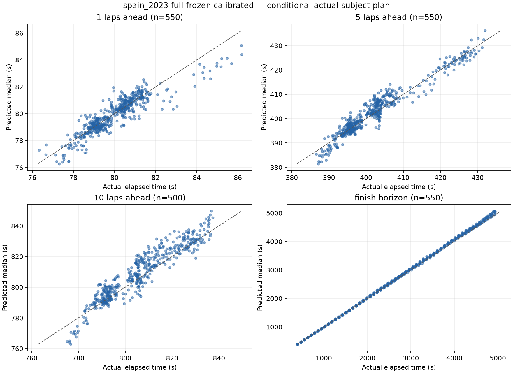
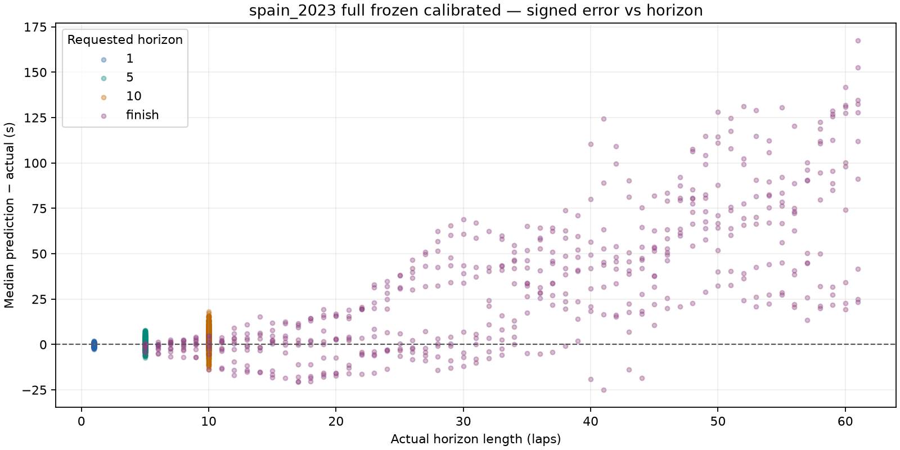
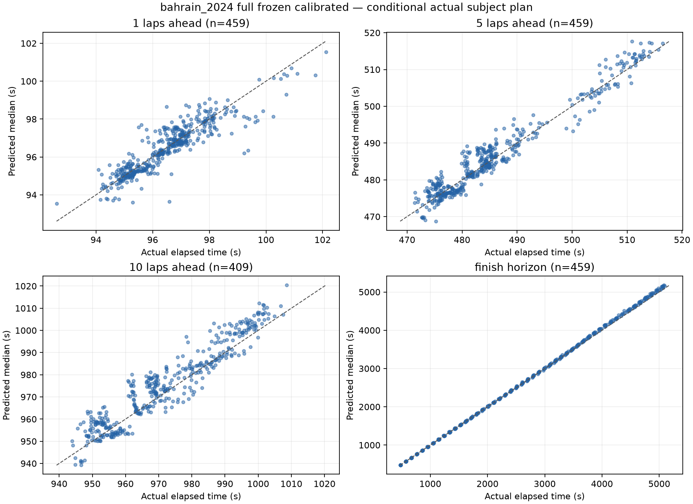
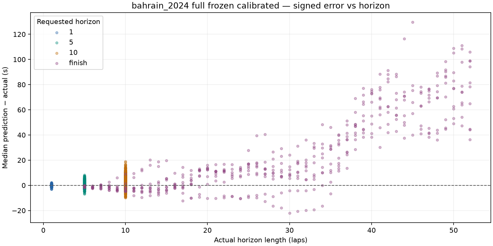

# Held-out evaluation: frozen calibrated development model

One evaluation of Spain 2023 and Bahrain 2024. Frozen tag `frozen-development-model-calibrated`, commit `0878c4d093bf5b2b0e901b17ea8887fa42b7bbe8`. No predictive code, priors, fitting rules or calibration changes. Acquisition was separate; all evaluation, development-reference replay and reporting ran with networking blocked.

[Protocol](PROTOCOL.md). [Metrics](metrics.json). [Development comparison](COMPARISON.md).

Signed error is median prediction minus actual. Full metrics mix green and sampled SC/VSC outcomes; conditional green metrics restrict both samples and actual outcomes as in development. Pools weight either each prediction or each available race equally. Pit strata normalize independently. Integer miss counts remain unweighted; equal-race rates are separate. Correlated snapshots are not independent observations.

## Findings and flagged limitations

The frozen model generalises reasonably at one lap, but its development interval
calibration does not maintain 80% green coverage at longer horizons. Equal-race
conditional green coverage is 82.1%, 77.3%, 75.2% and 67.6% at 1/5/10/finish,
versus development 80.5%, 78.5%, 80.1% and 73.8%. Finish MAE rises from 15.583 to
20.926 s, mean bias from +1.995 to +15.592 s, and median error from -0.958 to
+6.500 s. This is a flagged predictive weakness, not a numerical/invariant failure.

Stop-containing green finish horizons are the largest weakness: +24.202 s mean
bias, 29.234 s MAE and 62.5% coverage, versus no-stop +0.469 s bias, 6.179 s MAE
and 76.8% coverage. Early-cutoff finish errors include Russell at Spain lap 5:
+124.3 s conditional green error. One-lap stop coverage is still only 20.0%,
with -1.360 s bias: calibration has not solved pit-entry behaviour.

Green finish coverage is 68.4% in Spain and 66.8% in Bahrain. No-stop SOFT finish
error remains too fast: pooled -0.423 s/lap, Spain -0.598 s/lap. HARD no-stop
finish error is much closer to unbiased, pooled +0.021 s/lap. These are outcome
diagnostics, not proof of the cause of the stop-containing errors.

Neither held-out race contains an actual SC/VSC. The full combined finish view
has +28.679 s bias and 167.692 s width, versus green +15.592 s and 47.797 s.
Full finish coverage is only 73.3% despite that width. Two zero-event races
cannot establish neutralisation-risk calibration. The development full pool
also includes France's neutralisations, so comparisons reflect different race
cohorts rather than matched conditions.

No engine, prior, fitting-rule or calibration changes, data corrections, or
held-out reruns were made after these results. All frozen model files match the
tag. Evaluation is complete and stopped for review.

| Race | Scheduled laps | Stride | Attempted / valid snapshots | Full / green predictions | Runtime s |
| --- | ---: | ---: | --- | --- | ---: |
| spain_2023 | 66 | 1 | 570 / 550 | 2150 / 2150 | 543.6 |
| bahrain_2024 | 57 | 1 | 480 / 459 | 1786 / 1782 | 370.2 |

## Exclusions: spain_2023

| Scope / reason | Count |
| --- | ---: |
| snapshot:subject_stop_straddles_cutoff | 20 |
| target:target_beyond_finish_or_missing | 50 |

## Exclusions: bahrain_2024

| Scope / reason | Count |
| --- | ---: |
| snapshot:subject_stop_straddles_cutoff | 20 |
| snapshot:unknown_compound | 1 |
| target:target_beyond_finish_or_missing | 50 |

## full: spain_2023

## Median error, pit-stop split and error per lap

Signed error is predicted median minus actual. Pit-stop labels use actual subject pit-entry timestamps in (cutoff, target], solely as outcome diagnostics. All metrics are split by this label. Error/lap is computed for each prediction, then averaged or median-aggregated; finish horizons have different lengths.

| Horizon | Stops in horizon | N | MAE s | Mean bias s | Median error s | Mean error/lap s | Median error/lap s | MAE/lap s | Coverage | Mean width s | Below p10 | Above p90 | Interval score s |
| --- | --- | ---: | ---: | ---: | ---: | ---: | ---: | ---: | ---: | ---: | ---: | ---: | ---: |
| 1 | all | 550 | 0.433 | -0.052 | +0.009 | -0.052 | +0.009 | 0.433 | 84.0% | 1.871 | 28 | 60 | 2.738 |
| 1 | without_stop | 530 | 0.393 | +0.003 | +0.023 | +0.003 | +0.023 | 0.393 | 86.4% | 1.880 | 28 | 44 | 2.482 |
| 1 | with_stop | 20 | 1.519 | -1.519 | -1.440 | -1.519 | -1.440 | 1.519 | 20.0% | 1.639 | 0 | 16 | 9.519 |
| 5 | all | 550 | 2.048 | +0.619 | +0.479 | +0.124 | +0.096 | 0.410 | 84.2% | 9.112 | 45 | 42 | 11.530 |
| 5 | without_stop | 451 | 2.112 | +0.877 | +0.687 | +0.175 | +0.137 | 0.422 | 83.6% | 9.183 | 44 | 30 | 11.461 |
| 5 | with_stop | 99 | 1.755 | -0.557 | -0.446 | -0.111 | -0.089 | 0.351 | 86.9% | 8.789 | 1 | 12 | 11.846 |
| 10 | all | 500 | 5.112 | +3.102 | +2.802 | +0.310 | +0.280 | 0.511 | 87.8% | 34.848 | 61 | 0 | 37.684 |
| 10 | without_stop | 309 | 5.405 | +3.564 | +3.327 | +0.356 | +0.333 | 0.541 | 87.4% | 35.575 | 39 | 0 | 39.055 |
| 10 | with_stop | 191 | 4.637 | +2.354 | +2.046 | +0.235 | +0.205 | 0.464 | 88.5% | 33.672 | 22 | 0 | 35.465 |
| finish | all | 550 | 36.177 | +32.697 | +23.217 | +0.705 | +0.713 | 0.918 | 72.2% | 178.268 | 146 | 7 | 217.507 |
| finish | without_stop | 184 | 9.682 | +6.061 | +2.075 | +0.203 | +0.147 | 0.540 | 88.0% | 76.428 | 15 | 7 | 81.740 |
| finish | with_stop | 366 | 49.497 | +46.088 | +43.367 | +0.958 | +1.105 | 1.108 | 64.2% | 229.465 | 131 | 0 | 285.762 |

## full: bahrain_2024

## Median error, pit-stop split and error per lap

Signed error is predicted median minus actual. Pit-stop labels use actual subject pit-entry timestamps in (cutoff, target], solely as outcome diagnostics. All metrics are split by this label. Error/lap is computed for each prediction, then averaged or median-aggregated; finish horizons have different lengths.

| Horizon | Stops in horizon | N | MAE s | Mean bias s | Median error s | Mean error/lap s | Median error/lap s | MAE/lap s | Coverage | Mean width s | Below p10 | Above p90 | Interval score s |
| --- | --- | ---: | ---: | ---: | ---: | ---: | ---: | ---: | ---: | ---: | ---: | ---: | ---: |
| 1 | all | 459 | 0.411 | -0.028 | -0.057 | -0.028 | -0.057 | 0.411 | 80.2% | 1.564 | 39 | 52 | 2.499 |
| 1 | without_stop | 439 | 0.373 | +0.026 | -0.037 | +0.026 | -0.037 | 0.373 | 82.9% | 1.585 | 39 | 36 | 2.206 |
| 1 | with_stop | 20 | 1.234 | -1.201 | -1.403 | -1.201 | -1.403 | 1.234 | 20.0% | 1.091 | 0 | 16 | 8.937 |
| 5 | all | 459 | 2.059 | +0.650 | +0.321 | +0.130 | +0.064 | 0.412 | 74.5% | 7.653 | 67 | 50 | 11.412 |
| 5 | without_stop | 360 | 2.019 | +0.764 | +0.230 | +0.153 | +0.046 | 0.404 | 77.8% | 7.931 | 50 | 30 | 11.035 |
| 5 | with_stop | 99 | 2.203 | +0.234 | +0.560 | +0.047 | +0.112 | 0.441 | 62.6% | 6.646 | 17 | 20 | 12.783 |
| 10 | all | 409 | 5.177 | +3.198 | +3.074 | +0.320 | +0.307 | 0.518 | 78.0% | 39.106 | 90 | 0 | 45.629 |
| 10 | without_stop | 235 | 5.464 | +3.844 | +3.594 | +0.384 | +0.359 | 0.546 | 76.6% | 39.414 | 55 | 0 | 46.928 |
| 10 | with_stop | 174 | 4.791 | +2.325 | +2.704 | +0.233 | +0.270 | 0.479 | 79.9% | 38.689 | 35 | 0 | 43.875 |
| finish | all | 459 | 27.347 | +24.661 | +12.405 | +0.584 | +0.532 | 0.757 | 74.5% | 157.117 | 115 | 2 | 199.205 |
| finish | without_stop | 179 | 5.897 | +2.275 | -0.794 | +0.056 | -0.081 | 0.381 | 95.5% | 76.640 | 6 | 2 | 78.565 |
| finish | with_stop | 280 | 41.060 | +38.972 | +38.261 | +0.922 | +0.927 | 0.998 | 61.1% | 208.565 | 109 | 0 | 276.328 |

## full: pooled_prediction

## Median error, pit-stop split and error per lap

Signed error is predicted median minus actual. Pit-stop labels use actual subject pit-entry timestamps in (cutoff, target], solely as outcome diagnostics. All metrics are split by this label. Error/lap is computed for each prediction, then averaged or median-aggregated; finish horizons have different lengths.

| Horizon | Stops in horizon | N | MAE s | Mean bias s | Median error s | Mean error/lap s | Median error/lap s | MAE/lap s | Coverage | Mean width s | Below p10 | Above p90 | Interval score s |
| --- | --- | ---: | ---: | ---: | ---: | ---: | ---: | ---: | ---: | ---: | ---: | ---: | ---: |
| 1 | all | 1009 | 0.423 | -0.041 | -0.022 | -0.041 | -0.022 | 0.423 | 82.3% | 1.731 | 67 | 112 | 2.629 |
| 1 | without_stop | 969 | 0.384 | +0.014 | -0.008 | +0.014 | -0.008 | 0.384 | 84.8% | 1.746 | 67 | 80 | 2.357 |
| 1 | with_stop | 40 | 1.376 | -1.360 | -1.420 | -1.360 | -1.420 | 1.376 | 20.0% | 1.365 | 0 | 32 | 9.228 |
| 5 | all | 1009 | 2.053 | +0.633 | +0.408 | +0.127 | +0.082 | 0.411 | 79.8% | 8.449 | 112 | 92 | 11.476 |
| 5 | without_stop | 811 | 2.071 | +0.827 | +0.478 | +0.165 | +0.096 | 0.414 | 81.0% | 8.627 | 94 | 60 | 11.272 |
| 5 | with_stop | 198 | 1.979 | -0.162 | -0.121 | -0.032 | -0.024 | 0.396 | 74.7% | 7.717 | 18 | 32 | 12.314 |
| 10 | all | 909 | 5.141 | +3.145 | +2.978 | +0.315 | +0.298 | 0.514 | 83.4% | 36.764 | 151 | 0 | 41.259 |
| 10 | without_stop | 544 | 5.431 | +3.685 | +3.444 | +0.369 | +0.344 | 0.543 | 82.7% | 37.233 | 94 | 0 | 42.456 |
| 10 | with_stop | 365 | 4.710 | +2.341 | +2.430 | +0.234 | +0.243 | 0.471 | 84.4% | 36.064 | 57 | 0 | 39.474 |
| finish | all | 1009 | 32.160 | +29.041 | +16.685 | +0.650 | +0.596 | 0.845 | 73.2% | 168.646 | 261 | 9 | 209.181 |
| finish | without_stop | 363 | 7.816 | +4.194 | +0.520 | +0.130 | +0.045 | 0.462 | 91.7% | 76.532 | 21 | 9 | 80.175 |
| finish | with_stop | 646 | 45.840 | +43.004 | +41.657 | +0.943 | +1.000 | 1.060 | 62.8% | 220.407 | 240 | 0 | 281.673 |

## full: pooled_equal_race

## Median error, pit-stop split and error per lap

Signed error is predicted median minus actual. Pit-stop labels use actual subject pit-entry timestamps in (cutoff, target], solely as outcome diagnostics. All metrics are split by this label. Error/lap is computed for each prediction, then averaged or median-aggregated; finish horizons have different lengths.

| Horizon | Stops in horizon | N | MAE s | Mean bias s | Median error s | Mean error/lap s | Median error/lap s | MAE/lap s | Coverage | Mean width s | Below p10 | Above p90 | Interval score s |
| --- | --- | ---: | ---: | ---: | ---: | ---: | ---: | ---: | ---: | ---: | ---: | ---: | ---: |
| 1 | all | 1009 | 0.422 | -0.040 | -0.026 | -0.040 | -0.026 | 0.422 | 82.1% | 1.717 | 67 | 112 | 2.619 |
| 1 | without_stop | 969 | 0.383 | +0.015 | -0.010 | +0.015 | -0.010 | 0.383 | 84.7% | 1.733 | 67 | 80 | 2.344 |
| 1 | with_stop | 40 | 1.376 | -1.360 | -1.420 | -1.360 | -1.420 | 1.376 | 20.0% | 1.365 | 0 | 32 | 9.228 |
| 5 | all | 1009 | 2.053 | +0.634 | +0.396 | +0.127 | +0.079 | 0.411 | 79.3% | 8.383 | 112 | 92 | 11.471 |
| 5 | without_stop | 811 | 2.066 | +0.821 | +0.460 | +0.164 | +0.092 | 0.413 | 80.7% | 8.557 | 94 | 60 | 11.248 |
| 5 | with_stop | 198 | 1.979 | -0.162 | -0.121 | -0.032 | -0.024 | 0.396 | 74.7% | 7.717 | 18 | 32 | 12.314 |
| 10 | all | 909 | 5.145 | +3.150 | +2.993 | +0.315 | +0.299 | 0.514 | 82.9% | 36.977 | 151 | 0 | 41.656 |
| 10 | without_stop | 544 | 5.435 | +3.704 | +3.459 | +0.370 | +0.346 | 0.543 | 82.0% | 37.495 | 94 | 0 | 42.991 |
| 10 | with_stop | 365 | 4.714 | +2.340 | +2.478 | +0.234 | +0.248 | 0.471 | 84.2% | 36.180 | 57 | 0 | 39.670 |
| finish | all | 1009 | 31.762 | +28.679 | +16.023 | +0.645 | +0.591 | 0.838 | 73.3% | 167.692 | 261 | 9 | 208.356 |
| finish | without_stop | 363 | 7.790 | +4.168 | +0.498 | +0.129 | +0.045 | 0.461 | 91.8% | 76.534 | 21 | 9 | 80.153 |
| finish | with_stop | 646 | 45.278 | +42.530 | +41.503 | +0.940 | +0.989 | 1.053 | 62.6% | 219.015 | 240 | 0 | 281.045 |

| Horizon | Pit group | Races | Below p10 rate | Above p90 rate |
| --- | --- | ---: | ---: | ---: |
| 1 | all | 2 | 6.8% | 11.1% |
| 1 | without_stop | 2 | 7.1% | 8.3% |
| 1 | with_stop | 2 | 0.0% | 80.0% |
| 5 | all | 2 | 11.4% | 9.3% |
| 5 | without_stop | 2 | 11.8% | 7.5% |
| 5 | with_stop | 2 | 9.1% | 16.2% |
| 10 | all | 2 | 17.1% | 0.0% |
| 10 | without_stop | 2 | 18.0% | 0.0% |
| 10 | with_stop | 2 | 15.8% | 0.0% |
| finish | all | 2 | 25.8% | 0.9% |
| finish | without_stop | 2 | 5.8% | 2.5% |
| finish | with_stop | 2 | 37.4% | 0.0% |

## conditional_green: spain_2023

## Median error, pit-stop split and error per lap

Signed error is predicted median minus actual. Pit-stop labels use actual subject pit-entry timestamps in (cutoff, target], solely as outcome diagnostics. All metrics are split by this label. Error/lap is computed for each prediction, then averaged or median-aggregated; finish horizons have different lengths.

| Horizon | Stops in horizon | N | MAE s | Mean bias s | Median error s | Mean error/lap s | Median error/lap s | MAE/lap s | Coverage | Mean width s | Below p10 | Above p90 | Interval score s |
| --- | --- | ---: | ---: | ---: | ---: | ---: | ---: | ---: | ---: | ---: | ---: | ---: | ---: |
| 1 | all | 550 | 0.433 | -0.052 | +0.009 | -0.052 | +0.009 | 0.433 | 84.0% | 1.871 | 28 | 60 | 2.738 |
| 1 | without_stop | 530 | 0.393 | +0.003 | +0.023 | +0.003 | +0.023 | 0.393 | 86.4% | 1.880 | 28 | 44 | 2.482 |
| 1 | with_stop | 20 | 1.519 | -1.519 | -1.440 | -1.519 | -1.440 | 1.519 | 20.0% | 1.639 | 0 | 16 | 9.519 |
| 5 | all | 550 | 1.943 | +0.256 | +0.157 | +0.051 | +0.031 | 0.389 | 84.0% | 8.426 | 29 | 59 | 11.068 |
| 5 | without_stop | 451 | 1.975 | +0.489 | +0.376 | +0.098 | +0.075 | 0.395 | 84.5% | 8.540 | 28 | 42 | 10.916 |
| 5 | with_stop | 99 | 1.800 | -0.805 | -0.777 | -0.161 | -0.155 | 0.360 | 81.8% | 7.911 | 1 | 17 | 11.757 |
| 10 | all | 500 | 4.394 | +1.646 | +1.567 | +0.165 | +0.157 | 0.439 | 83.0% | 17.980 | 42 | 43 | 23.681 |
| 10 | without_stop | 309 | 4.606 | +2.008 | +1.797 | +0.201 | +0.180 | 0.461 | 83.5% | 19.496 | 30 | 21 | 25.295 |
| 10 | with_stop | 191 | 4.050 | +1.060 | +0.579 | +0.106 | +0.058 | 0.405 | 82.2% | 15.526 | 12 | 22 | 21.069 |
| finish | all | 550 | 23.895 | +17.710 | +8.383 | +0.327 | +0.318 | 0.651 | 68.4% | 55.491 | 95 | 79 | 87.112 |
| finish | without_stop | 184 | 7.293 | +1.972 | -0.306 | -0.013 | -0.026 | 0.441 | 79.9% | 25.748 | 11 | 26 | 36.118 |
| finish | with_stop | 366 | 32.241 | +25.622 | +25.917 | +0.498 | +0.639 | 0.757 | 62.6% | 70.444 | 84 | 53 | 112.749 |

## conditional_green: bahrain_2024

## Median error, pit-stop split and error per lap

Signed error is predicted median minus actual. Pit-stop labels use actual subject pit-entry timestamps in (cutoff, target], solely as outcome diagnostics. All metrics are split by this label. Error/lap is computed for each prediction, then averaged or median-aggregated; finish horizons have different lengths.

| Horizon | Stops in horizon | N | MAE s | Mean bias s | Median error s | Mean error/lap s | Median error/lap s | MAE/lap s | Coverage | Mean width s | Below p10 | Above p90 | Interval score s |
| --- | --- | ---: | ---: | ---: | ---: | ---: | ---: | ---: | ---: | ---: | ---: | ---: | ---: |
| 1 | all | 458 | 0.411 | -0.028 | -0.057 | -0.028 | -0.057 | 0.411 | 80.1% | 1.565 | 39 | 52 | 2.503 |
| 1 | without_stop | 438 | 0.374 | +0.025 | -0.038 | +0.025 | -0.038 | 0.374 | 82.9% | 1.587 | 39 | 36 | 2.209 |
| 1 | with_stop | 20 | 1.234 | -1.201 | -1.403 | -1.201 | -1.403 | 1.234 | 20.0% | 1.091 | 0 | 16 | 8.937 |
| 5 | all | 458 | 1.996 | +0.368 | -0.057 | +0.074 | -0.011 | 0.399 | 70.5% | 7.087 | 54 | 81 | 11.062 |
| 5 | without_stop | 359 | 1.953 | +0.454 | -0.096 | +0.091 | -0.019 | 0.391 | 72.4% | 7.367 | 42 | 57 | 10.581 |
| 5 | with_stop | 99 | 2.153 | +0.056 | +0.140 | +0.011 | +0.028 | 0.431 | 63.6% | 6.069 | 12 | 24 | 12.809 |
| 10 | all | 408 | 4.625 | +2.005 | +1.825 | +0.200 | +0.183 | 0.463 | 67.4% | 14.935 | 73 | 60 | 23.580 |
| 10 | without_stop | 235 | 4.826 | +2.486 | +2.362 | +0.249 | +0.236 | 0.483 | 71.5% | 16.302 | 40 | 27 | 23.780 |
| 10 | with_stop | 173 | 4.352 | +1.351 | +1.554 | +0.135 | +0.155 | 0.435 | 61.8% | 13.079 | 33 | 33 | 23.309 |
| finish | all | 458 | 17.957 | +13.475 | +4.848 | +0.264 | +0.229 | 0.536 | 66.8% | 40.103 | 82 | 70 | 73.765 |
| finish | without_stop | 179 | 5.065 | -1.033 | -2.217 | -0.138 | -0.234 | 0.364 | 73.7% | 22.647 | 4 | 43 | 28.290 |
| finish | with_stop | 279 | 26.228 | +22.782 | +20.534 | +0.522 | +0.504 | 0.646 | 62.4% | 51.303 | 78 | 27 | 102.941 |

## conditional_green: pooled_prediction

## Median error, pit-stop split and error per lap

Signed error is predicted median minus actual. Pit-stop labels use actual subject pit-entry timestamps in (cutoff, target], solely as outcome diagnostics. All metrics are split by this label. Error/lap is computed for each prediction, then averaged or median-aggregated; finish horizons have different lengths.

| Horizon | Stops in horizon | N | MAE s | Mean bias s | Median error s | Mean error/lap s | Median error/lap s | MAE/lap s | Coverage | Mean width s | Below p10 | Above p90 | Interval score s |
| --- | --- | ---: | ---: | ---: | ---: | ---: | ---: | ---: | ---: | ---: | ---: | ---: | ---: |
| 1 | all | 1008 | 0.423 | -0.041 | -0.022 | -0.041 | -0.022 | 0.423 | 82.2% | 1.732 | 67 | 112 | 2.631 |
| 1 | without_stop | 968 | 0.384 | +0.013 | -0.008 | +0.013 | -0.008 | 0.384 | 84.8% | 1.747 | 67 | 80 | 2.359 |
| 1 | with_stop | 40 | 1.376 | -1.360 | -1.420 | -1.360 | -1.420 | 1.376 | 20.0% | 1.365 | 0 | 32 | 9.228 |
| 5 | all | 1008 | 1.967 | +0.307 | +0.082 | +0.061 | +0.016 | 0.393 | 77.9% | 7.818 | 83 | 140 | 11.065 |
| 5 | without_stop | 810 | 1.965 | +0.474 | +0.170 | +0.095 | +0.034 | 0.393 | 79.1% | 8.020 | 70 | 99 | 10.768 |
| 5 | with_stop | 198 | 1.976 | -0.374 | -0.406 | -0.075 | -0.081 | 0.395 | 72.7% | 6.990 | 13 | 41 | 12.283 |
| 10 | all | 908 | 4.498 | +1.807 | +1.678 | +0.181 | +0.168 | 0.450 | 76.0% | 16.612 | 115 | 103 | 23.635 |
| 10 | without_stop | 544 | 4.701 | +2.215 | +1.982 | +0.221 | +0.198 | 0.470 | 78.3% | 18.116 | 70 | 48 | 24.640 |
| 10 | with_stop | 364 | 4.193 | +1.198 | +1.061 | +0.120 | +0.106 | 0.419 | 72.5% | 14.363 | 45 | 55 | 22.134 |
| finish | all | 1008 | 21.197 | +15.785 | +6.697 | +0.298 | +0.263 | 0.599 | 67.7% | 48.499 | 177 | 149 | 81.048 |
| finish | without_stop | 363 | 6.194 | +0.490 | -1.192 | -0.075 | -0.125 | 0.403 | 76.9% | 24.219 | 15 | 69 | 32.258 |
| finish | with_stop | 645 | 29.640 | +24.393 | +23.168 | +0.508 | +0.531 | 0.709 | 62.5% | 62.164 | 162 | 80 | 108.507 |

## conditional_green: pooled_equal_race

## Median error, pit-stop split and error per lap

Signed error is predicted median minus actual. Pit-stop labels use actual subject pit-entry timestamps in (cutoff, target], solely as outcome diagnostics. All metrics are split by this label. Error/lap is computed for each prediction, then averaged or median-aggregated; finish horizons have different lengths.

| Horizon | Stops in horizon | N | MAE s | Mean bias s | Median error s | Mean error/lap s | Median error/lap s | MAE/lap s | Coverage | Mean width s | Below p10 | Above p90 | Interval score s |
| --- | --- | ---: | ---: | ---: | ---: | ---: | ---: | ---: | ---: | ---: | ---: | ---: | ---: |
| 1 | all | 1008 | 0.422 | -0.040 | -0.026 | -0.040 | -0.026 | 0.422 | 82.1% | 1.718 | 67 | 112 | 2.620 |
| 1 | without_stop | 968 | 0.383 | +0.014 | -0.011 | +0.014 | -0.011 | 0.383 | 84.6% | 1.733 | 67 | 80 | 2.346 |
| 1 | with_stop | 40 | 1.376 | -1.360 | -1.420 | -1.360 | -1.420 | 1.376 | 20.0% | 1.365 | 0 | 32 | 9.228 |
| 5 | all | 1008 | 1.970 | +0.312 | +0.078 | +0.062 | +0.016 | 0.394 | 77.3% | 7.757 | 83 | 140 | 11.065 |
| 5 | without_stop | 810 | 1.964 | +0.472 | +0.146 | +0.094 | +0.029 | 0.393 | 78.5% | 7.953 | 70 | 99 | 10.749 |
| 5 | with_stop | 198 | 1.976 | -0.374 | -0.406 | -0.075 | -0.081 | 0.395 | 72.7% | 6.990 | 13 | 41 | 12.283 |
| 10 | all | 908 | 4.509 | +1.825 | +1.724 | +0.183 | +0.172 | 0.451 | 75.2% | 16.458 | 115 | 103 | 23.630 |
| 10 | without_stop | 544 | 4.716 | +2.247 | +2.052 | +0.225 | +0.205 | 0.472 | 77.5% | 17.899 | 70 | 48 | 24.537 |
| 10 | with_stop | 364 | 4.201 | +1.206 | +1.066 | +0.121 | +0.107 | 0.420 | 72.0% | 14.303 | 45 | 55 | 22.189 |
| finish | all | 1008 | 20.926 | +15.592 | +6.500 | +0.296 | +0.259 | 0.594 | 67.6% | 47.797 | 177 | 149 | 80.439 |
| finish | without_stop | 363 | 6.179 | +0.469 | -1.211 | -0.075 | -0.125 | 0.402 | 76.8% | 24.197 | 15 | 69 | 32.204 |
| finish | with_stop | 645 | 29.234 | +24.202 | +22.889 | +0.510 | +0.525 | 0.701 | 62.5% | 60.873 | 162 | 80 | 107.845 |

| Horizon | Pit group | Races | Below p10 rate | Above p90 rate |
| --- | --- | ---: | ---: | ---: |
| 1 | all | 2 | 6.8% | 11.1% |
| 1 | without_stop | 2 | 7.1% | 8.3% |
| 1 | with_stop | 2 | 0.0% | 80.0% |
| 5 | all | 2 | 8.5% | 14.2% |
| 5 | without_stop | 2 | 9.0% | 12.6% |
| 5 | with_stop | 2 | 6.6% | 20.7% |
| 10 | all | 2 | 13.1% | 11.7% |
| 10 | without_stop | 2 | 13.4% | 9.1% |
| 10 | with_stop | 2 | 12.7% | 15.3% |
| finish | all | 2 | 17.6% | 14.8% |
| finish | without_stop | 2 | 4.1% | 19.1% |
| finish | with_stop | 2 | 25.5% | 12.1% |

## Five worst full predictions: spain_2023

| Driver | Cutoff | Horizon | Median error s | Actual SC/VSC in horizon | Stop in horizon |
| --- | ---: | --- | ---: | --- | --- |
| RUS | 5 | finish | +167.449 | False | True |
| PER | 5 | finish | +152.635 | False | True |
| RUS | 6 | finish | +141.834 | False | True |
| ZHO | 5 | finish | +134.691 | False | True |
| GAS | 5 | finish | +132.332 | False | True |

These labels are descriptive, not proof of cause. Pace anchor, wear/cliff and pit-transition assumptions can dominate green errors; actual neutralisations can dominate full-view errors.

## Five worst full predictions: bahrain_2024

| Driver | Cutoff | Horizon | Median error s | Actual SC/VSC in horizon | Stop in horizon |
| --- | ---: | --- | ---: | --- | --- |
| STR | 12 | finish | +129.600 | False | True |
| STR | 13 | finish | +116.532 | False | True |
| ALO | 6 | finish | +111.019 | False | True |
| PER | 7 | finish | +108.966 | False | True |
| PER | 6 | finish | +108.331 | False | True |

These labels are descriptive, not proof of cause. Pace anchor, wear/cliff and pit-transition assumptions can dominate green errors; actual neutralisations can dominate full-view errors.

[Compound/age and event diagnostics](DIAGNOSTICS.md).
