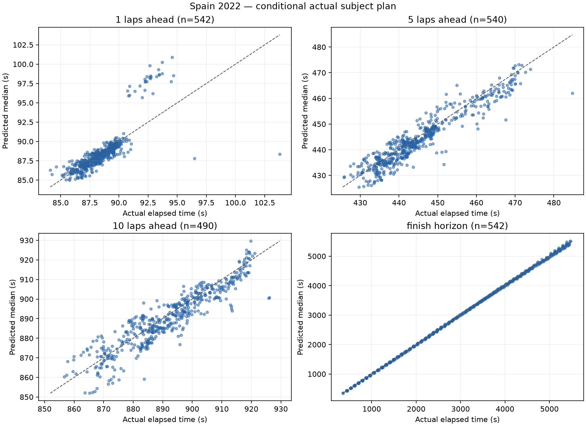
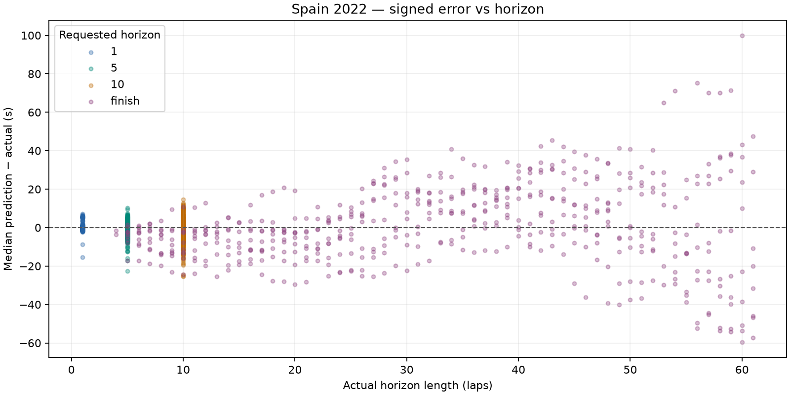

# Spain 2022: dry conditional prediction

Spain 2022 development race only. No race-wide fitting, agreement/disagreement analysis or UI changes.

Prediction source: fresh offline simulation. Previous comparison: docs\evaluation\spain_2022_ongoing.

## Dataset and runtime

- Top ten: VER, PER, RUS, SAI, HAM, BOT, OCO, NOR, ALO, TSU.
- Scheduled distance: 66 laps; cutoffs 5-61 inclusive; stride 1.
- Attempted snapshots: 570; evaluated: 542; excluded: 28.
- Scored predictions: 2114; excluded horizon targets: 54.
- Benchmark: 3 snapshots, mean 0.586s/snapshot; estimated full run 5.56 minutes.
- Actual evaluation loop: 479.22s. Every lap retained because estimated runtime was below 30 minutes.
- Entire evaluation ran with socket connections blocked; acquisition was a separate operation.

### Exclusions

| Scope | Reason | Count |
| --- | --- | ---: |
| snapshot | subject_stop_straddles_cutoff | 28 |
| target | target_beyond_finish_or_missing | 54 |

## Accuracy

Bias is predicted median minus actual elapsed time: negative means too fast. Coverage uses inclusive absolute p10–p90 endpoints; nominal target is 80%. Width is the mean p90 minus p10. Existing uncertainty is reported without post-result widening.

| Horizon | N | MAE (s) | Mean bias (s) | Median error (s) | Coverage | Mean width (s) | Below p10 | Above p90 | Interval score (s) |
| --- | ---: | ---: | ---: | ---: | ---: | ---: | ---: | ---: | ---: |
| 1 | 542 | 0.781 | +0.049 | -0.142 | 62.7% | 1.183 | 73 | 129 | 5.399 |
| 5 | 540 | 2.811 | -1.063 | -1.146 | 46.9% | 4.377 | 89 | 198 | 17.208 |
| 10 | 490 | 4.888 | -1.683 | -1.760 | 85.3% | 32.865 | 72 | 0 | 37.510 |
| finish | 542 | 16.007 | +1.313 | -1.174 | 77.7% | 174.074 | 93 | 28 | 189.499 |

## Median error, pit-stop split and error per lap

Signed error is predicted median minus actual. Pit-stop labels use actual subject pit-entry timestamps in (cutoff, target], solely as outcome diagnostics. All metrics are split by this label. Error/lap is computed for each prediction, then averaged or median-aggregated; finish horizons have different lengths.

| Horizon | Stops in horizon | N | MAE s | Mean bias s | Median error s | Mean error/lap s | Median error/lap s | MAE/lap s | Coverage | Mean width s | Below p10 | Above p90 | Interval score s |
| --- | --- | ---: | ---: | ---: | ---: | ---: | ---: | ---: | ---: | ---: | ---: | ---: | ---: |
| 1 | all | 542 | 0.781 | +0.049 | -0.142 | +0.049 | -0.142 | 0.781 | 62.7% | 1.183 | 73 | 129 | 5.399 |
| 1 | without_stop | 514 | 0.535 | -0.237 | -0.165 | -0.237 | -0.165 | 0.535 | 66.1% | 1.168 | 45 | 129 | 3.112 |
| 1 | with_stop | 28 | 5.303 | +5.303 | +5.401 | +5.303 | +5.401 | 5.303 | 0.0% | 1.472 | 28 | 0 | 47.381 |
| 5 | all | 540 | 2.811 | -1.063 | -1.146 | -0.213 | -0.229 | 0.562 | 46.9% | 4.377 | 89 | 198 | 17.208 |
| 5 | without_stop | 400 | 2.503 | -1.002 | -0.962 | -0.200 | -0.192 | 0.501 | 50.2% | 4.462 | 61 | 138 | 14.383 |
| 5 | with_stop | 140 | 3.689 | -1.237 | -1.568 | -0.247 | -0.314 | 0.738 | 37.1% | 4.134 | 28 | 60 | 25.277 |
| 10 | all | 490 | 4.888 | -1.683 | -1.760 | -0.168 | -0.176 | 0.489 | 85.3% | 32.865 | 72 | 0 | 37.510 |
| 10 | without_stop | 234 | 5.365 | -1.270 | -1.530 | -0.127 | -0.153 | 0.537 | 78.2% | 33.036 | 51 | 0 | 40.175 |
| 10 | with_stop | 256 | 4.452 | -2.061 | -1.930 | -0.206 | -0.193 | 0.445 | 91.8% | 32.709 | 21 | 0 | 35.074 |
| finish | all | 542 | 16.007 | +1.313 | -1.174 | -0.092 | -0.054 | 0.544 | 77.7% | 174.074 | 93 | 28 | 189.499 |
| finish | without_stop | 127 | 8.608 | -6.198 | -4.811 | -0.612 | -0.455 | 0.792 | 71.7% | 53.100 | 8 | 28 | 71.753 |
| finish | with_stop | 415 | 18.271 | +3.612 | +3.748 | +0.067 | +0.135 | 0.468 | 79.5% | 211.095 | 85 | 0 | 225.532 |

## Matched comparison with previous run

Same driver/cutoff/target cohort. Entries are previous → current; zero-sample pit-stop strata are unavailable. No outcome-derived tuning is applied.

| Horizon | Stops | N | Mean bias s | Median error s | MAE s | Coverage | Mean width s |
| --- | --- | ---: | --- | --- | --- | --- | --- |
| 1 | all | 542 | +0.049 → +0.049 | -0.142 → -0.142 | 0.781 → 0.781 | 62.7% → 62.7% | 1.183 → 1.183 |
| 1 | without_stop | 514 | -0.237 → -0.237 | -0.165 → -0.165 | 0.535 → 0.535 | 66.1% → 66.1% | 1.168 → 1.168 |
| 1 | with_stop | 28 | +5.303 → +5.303 | +5.401 → +5.401 | 5.303 → 5.303 | 0.0% → 0.0% | 1.472 → 1.472 |
| 5 | all | 540 | -1.305 → -1.063 | -1.392 → -1.146 | 2.881 → 2.811 | 41.1% → 46.9% | 3.856 → 4.377 |
| 5 | without_stop | 400 | -1.240 → -1.002 | -1.253 → -0.962 | 2.576 → 2.503 | 45.5% → 50.2% | 3.922 → 4.462 |
| 5 | with_stop | 140 | -1.492 → -1.237 | -1.776 → -1.568 | 3.753 → 3.689 | 28.6% → 37.1% | 3.666 → 4.134 |
| 10 | all | 490 | -2.525 → -1.683 | -2.634 → -1.760 | 5.032 → 4.888 | 40.4% → 85.3% | 6.679 → 32.865 |
| 10 | without_stop | 234 | -2.122 → -1.270 | -2.516 → -1.530 | 5.534 → 5.365 | 38.0% → 78.2% | 7.222 → 33.036 |
| 10 | with_stop | 256 | -2.893 → -2.061 | -2.691 → -1.930 | 4.574 → 4.452 | 42.6% → 91.8% | 6.181 → 32.709 |
| finish | all | 542 | -10.356 → +1.313 | -7.479 → -1.174 | 16.702 → 16.007 | 39.7% → 77.7% | 20.821 → 174.074 |
| finish | without_stop | 127 | -7.985 → -6.198 | -6.339 → -4.811 | 9.909 → 8.608 | 35.4% → 71.7% | 9.586 → 53.100 |
| finish | with_stop | 415 | -11.081 → +3.612 | -7.704 → +3.748 | 18.781 → 18.271 | 41.0% → 79.5% | 24.259 → 211.095 |

Coverage remains below 80%; the model's uncertainty does not cover all real pace and pit timing variation. These are correlated snapshots from one development race, not an independent calibration result.





## Five worst predictions

Ranked across all scored horizons by absolute median error; several may come from the same driver or adjacent cutoffs.

| Driver | Cutoff | Target / horizon | Actual (s) | Median (s) | p10–p90 (s) | Error (s) |
| --- | ---: | --- | ---: | ---: | --- | ---: |
| ALO | 5 | 65 / finish | 5387.893 | 5487.773 | 5413.109–5739.383 | +99.880 |
| ALO | 9 | 65 / finish | 5027.526 | 5102.755 | 5050.127–5374.301 | +75.229 |
| ALO | 6 | 65 / finish | 5297.504 | 5368.784 | 5288.041–5629.704 | +71.280 |
| ALO | 11 | 65 / finish | 4825.844 | 4896.907 | 4847.971–5145.154 | +71.063 |
| ALO | 8 | 65 / finish | 5117.195 | 5187.392 | 5124.012–5466.988 | +70.197 |

1. **ALO, cutoff 5, finish:** Pace anchor: median, clean lap(s) [3]; fresh base 90.113s, cutoff tyre age 5; 3 future stop(s) in this horizon. Prediction is too slow. Fixed compound wear/cliff and the cutoff pace anchor can accumulate excessive cost over the horizon. This is a model-based diagnostic, not proof of a single cause.

2. **ALO, cutoff 9, finish:** Pace anchor: median, clean lap(s) [6, 3]; fresh base 89.716s, cutoff tyre age 9; 3 future stop(s) in this horizon. Prediction is too slow. Fixed compound wear/cliff and the cutoff pace anchor can accumulate excessive cost over the horizon. This is a model-based diagnostic, not proof of a single cause.

3. **ALO, cutoff 6, finish:** Pace anchor: median, clean lap(s) [4, 3]; fresh base 89.555s, cutoff tyre age 6; 3 future stop(s) in this horizon. Prediction is too slow. Fixed compound wear/cliff and the cutoff pace anchor can accumulate excessive cost over the horizon. This is a model-based diagnostic, not proof of a single cause.

4. **ALO, cutoff 11, finish:** Pace anchor: median, clean lap(s) [6, 3]; fresh base 89.616s, cutoff tyre age 1; 2 future stop(s) in this horizon. Prediction is too slow. Fixed compound wear/cliff and the cutoff pace anchor can accumulate excessive cost over the horizon. This is a model-based diagnostic, not proof of a single cause.

5. **ALO, cutoff 8, finish:** Pace anchor: median, clean lap(s) [6]; fresh base 89.569s, cutoff tyre age 8; 3 future stop(s) in this horizon. Prediction is too slow. Fixed compound wear/cliff and the cutoff pace anchor can accumulate excessive cost over the horizon. This is a model-based diagnostic, not proof of a single cause.

## Protocol and limitations

- Exact cutoff coordinates and actual elapsed labels use FastF1 corrected crossing Time. Pace/position/pit state uses only earlier raw TimingData packets; tyres use earlier TimingAppData updates. A LastLapTime received after the crossing is excluded until its packet arrives, even if this leaves the newest known pace one lap old.
- Gap exception: only rival same-lap crossing Time may follow cutoff, tagged live_timing_proxy_same_lap_crossing. Its other fields are never read. Missing crossings use a disclosed stale earlier common-lap gap. This is a retrospective crossing proxy, not a captured live gap feed.
- Session datetimes are epoch-encoded session-relative clocks, not asserted UTC wall times. Each snapshot saves exact cutoff seconds, source timestamps and parameter configuration.
- Frozen compound degradation scale 1, fuel 0.05s/lap, pit losses 21.5/12.5/9.5s, cliff/traffic/SC defaults. Fresh base pace uses the median of the last six available clean laps, removing the central observation(s)' nominal compound/wear cost and advancing fuel effect to cutoff (minimum baseline uses its single fastest observation). No regression-based degradation or race-wide fitting is used.
- Dry persistence, no forecast; seed 18, 32 shared samples, uniform pit offsets +/-1.5s and wear multipliers +/-15%. Normal subject-only persistent pace offset (SD=s/sqrt(n)) and independent per-lap noise (SD=s), sized from the same driver's last six available clean laps after nominal wear/fuel corrections; antithetic paired draws, separate seed streams. One clean observation gives zero scatter. No error-based tuning. Future SC/VSC onset, duration and pace effects use the frozen 2019 prior. Random traffic, damage, strategic lift-off and warm-up remain unmodeled.
- Actual subject stop schedule/compounds are supplied only AFTER constructing the snapshot, as conditional treatment. Autonomous subject stops are suppressed. Corrected full-session tyre labels are used only for this actual-plan treatment, never cutoff features. Rivals retain engine tyre-life stop assumptions, not observed future strategies.
- Pit-in lap K maps to boundary K-1. A frozen 50/50 allocation charges half the sampled entry-time total on K and the remainder on K+1, for subject and modeled rival stops. A final-lap stop charges the whole total before finish. The share is an unestimated neutral default, not fitted to evaluation data. Fresh tyre timing remains the existing entry-lap approximation; used replacement tyres are not modeled. Subject snapshots inside the pit are excluded.
- Ongoing SC/VSC ends after an expected remaining duration conditioned on causal elapsed time, using the committed 2019 dry-race prior, never the actual ending. No later status is injected. Final classification selects subjects outside the engine (survivor bias). No held-out/wet evaluation is performed.

## Reproduction

From the repository root, after acquiring the authorized race once:

```powershell
.\.venv\Scripts\python.exe -m tools.evaluate_bahrain --output docs/evaluation/spain_2022_future --dataset data\cache\evaluation\spain_2022\session.json --compare-to docs\evaluation\spain_2022_ongoing
```

The command loads only the hash-verified local normalized cache, blocks network connections and regenerates this report. A missing/corrupt cache fails rather than downloading. Acquisition: `python -m tools.acquire_bahrain_evaluation --race spain_2022`.

- [Metrics](metrics.json), [predictions](predictions.csv), [exclusions](exclusions.json).
- [Manifest](manifest.json) records source/code hashes, versions, benchmark and defaults.
- Full state/config/plan audit: local ignored `data\cache\evaluation\spain_2022\snapshots_spain_2022_future.jsonl`.
