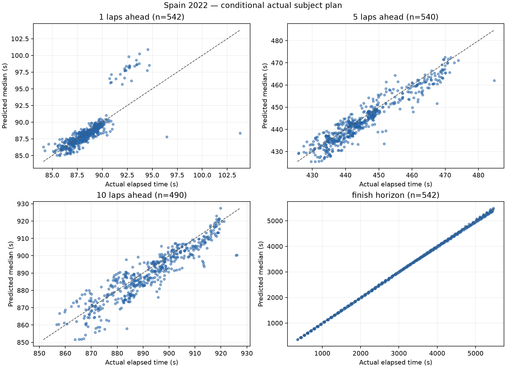
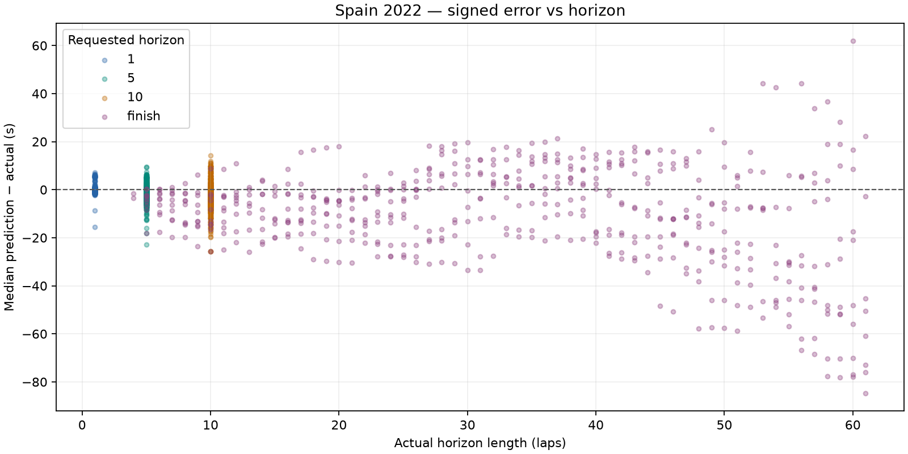

# Spain 2022: dry conditional prediction

Spain 2022 development race only. No race-wide fitting, agreement/disagreement analysis or UI changes.

Prediction source: fresh offline simulation. Previous comparison: docs\evaluation\spain_2022_pit_split.

## Dataset and runtime

- Top ten: VER, PER, RUS, SAI, HAM, BOT, OCO, NOR, ALO, TSU.
- Scheduled distance: 66 laps; cutoffs 5-61 inclusive; stride 1.
- Attempted snapshots: 570; evaluated: 542; excluded: 28.
- Scored predictions: 2114; excluded horizon targets: 54.
- Benchmark: 3 snapshots, mean 0.562s/snapshot; estimated full run 5.34 minutes.
- Actual evaluation loop: 487.88s. Every lap retained because estimated runtime was below 30 minutes.
- Entire evaluation ran with socket connections blocked; acquisition was a separate operation.

### Exclusions

| Scope | Reason | Count |
| --- | --- | ---: |
| snapshot | subject_stop_straddles_cutoff | 28 |
| target | target_beyond_finish_or_missing | 54 |

## Accuracy

Bias is predicted median minus actual elapsed time: negative means too fast. Coverage uses inclusive absolute p10–p90 endpoints; nominal target is 80%. Width is the mean p90 minus p10. Existing uncertainty is reported without post-result widening.

| Horizon | N | MAE (s) | Mean bias (s) | Median error (s) | Coverage | Mean width (s) | Below p10 | Above p90 | Interval score (s) |
| --- | ---: | ---: | ---: | ---: | ---: | ---: | ---: | ---: | ---: |
| 1 | 542 | 0.781 | +0.049 | -0.142 | 62.7% | 1.183 | 73 | 129 | 5.399 |
| 5 | 540 | 2.881 | -1.305 | -1.392 | 41.1% | 3.856 | 87 | 231 | 18.415 |
| 10 | 490 | 5.032 | -2.525 | -2.634 | 40.4% | 6.679 | 66 | 226 | 32.325 |
| finish | 542 | 16.702 | -10.356 | -7.479 | 39.7% | 20.821 | 58 | 269 | 108.721 |

## Median error, pit-stop split and error per lap

Signed error is predicted median minus actual. Pit-stop labels use actual subject pit-entry timestamps in (cutoff, target], solely as outcome diagnostics. All metrics are split by this label. Error/lap is computed for each prediction, then averaged or median-aggregated; finish horizons have different lengths.

| Horizon | Stops in horizon | N | MAE s | Mean bias s | Median error s | Mean error/lap s | Median error/lap s | MAE/lap s | Coverage | Mean width s | Below p10 | Above p90 | Interval score s |
| --- | --- | ---: | ---: | ---: | ---: | ---: | ---: | ---: | ---: | ---: | ---: | ---: | ---: |
| 1 | all | 542 | 0.781 | +0.049 | -0.142 | +0.049 | -0.142 | 0.781 | 62.7% | 1.183 | 73 | 129 | 5.399 |
| 1 | without_stop | 514 | 0.535 | -0.237 | -0.165 | -0.237 | -0.165 | 0.535 | 66.1% | 1.168 | 45 | 129 | 3.112 |
| 1 | with_stop | 28 | 5.303 | +5.303 | +5.401 | +5.303 | +5.401 | 5.303 | 0.0% | 1.472 | 28 | 0 | 47.381 |
| 5 | all | 540 | 2.881 | -1.305 | -1.392 | -0.261 | -0.278 | 0.576 | 41.1% | 3.856 | 87 | 231 | 18.415 |
| 5 | without_stop | 400 | 2.576 | -1.240 | -1.253 | -0.248 | -0.251 | 0.515 | 45.5% | 3.922 | 59 | 159 | 15.484 |
| 5 | with_stop | 140 | 3.753 | -1.492 | -1.776 | -0.298 | -0.355 | 0.751 | 28.6% | 3.666 | 28 | 72 | 26.790 |
| 10 | all | 490 | 5.032 | -2.525 | -2.634 | -0.253 | -0.263 | 0.503 | 40.4% | 6.679 | 66 | 226 | 32.325 |
| 10 | without_stop | 234 | 5.534 | -2.122 | -2.516 | -0.212 | -0.252 | 0.553 | 38.0% | 7.222 | 50 | 95 | 34.066 |
| 10 | with_stop | 256 | 4.574 | -2.893 | -2.691 | -0.289 | -0.269 | 0.457 | 42.6% | 6.181 | 16 | 131 | 30.733 |
| finish | all | 542 | 16.702 | -10.356 | -7.479 | -0.384 | -0.289 | 0.564 | 39.7% | 20.821 | 58 | 269 | 108.721 |
| finish | without_stop | 127 | 9.909 | -7.985 | -6.339 | -0.738 | -0.662 | 0.873 | 35.4% | 9.586 | 7 | 75 | 66.677 |
| finish | with_stop | 415 | 18.781 | -11.081 | -7.704 | -0.276 | -0.217 | 0.470 | 41.0% | 24.259 | 51 | 194 | 121.587 |

## Matched comparison with previous run

Same driver/cutoff/target cohort. Entries are previous → current; zero-sample pit-stop strata are unavailable. No outcome-derived tuning is applied.

| Horizon | Stops | N | Mean bias s | Median error s | MAE s | Coverage | Mean width s |
| --- | --- | ---: | --- | --- | --- | --- | --- |
| 1 | all | 542 | +0.049 → +0.049 | -0.142 → -0.142 | 0.781 → 0.781 | 62.7% → 62.7% | 1.183 → 1.183 |
| 1 | without_stop | 514 | -0.237 → -0.237 | -0.165 → -0.165 | 0.535 → 0.535 | 66.1% → 66.1% | 1.168 → 1.168 |
| 1 | with_stop | 28 | +5.303 → +5.303 | +5.401 → +5.401 | 5.303 → 5.303 | 0.0% → 0.0% | 1.472 → 1.472 |
| 5 | all | 540 | -1.305 → -1.305 | -1.392 → -1.392 | 2.881 → 2.881 | 41.1% → 41.1% | 3.856 → 3.856 |
| 5 | without_stop | 400 | -1.240 → -1.240 | -1.253 → -1.253 | 2.576 → 2.576 | 45.5% → 45.5% | 3.922 → 3.922 |
| 5 | with_stop | 140 | -1.492 → -1.492 | -1.776 → -1.776 | 3.753 → 3.753 | 28.6% → 28.6% | 3.666 → 3.666 |
| 10 | all | 490 | -2.525 → -2.525 | -2.634 → -2.634 | 5.032 → 5.032 | 40.4% → 40.4% | 6.679 → 6.679 |
| 10 | without_stop | 234 | -2.122 → -2.122 | -2.516 → -2.516 | 5.534 → 5.534 | 38.0% → 38.0% | 7.222 → 7.222 |
| 10 | with_stop | 256 | -2.893 → -2.893 | -2.691 → -2.691 | 4.574 → 4.574 | 42.6% → 42.6% | 6.181 → 6.181 |
| finish | all | 542 | -10.356 → -10.356 | -7.479 → -7.479 | 16.702 → 16.702 | 39.7% → 39.7% | 20.821 → 20.821 |
| finish | without_stop | 127 | -7.985 → -7.985 | -6.339 → -6.339 | 9.909 → 9.909 | 35.4% → 35.4% | 9.586 → 9.586 |
| finish | with_stop | 415 | -11.081 → -11.081 | -7.704 → -7.704 | 18.781 → 18.781 | 41.0% → 41.0% | 24.259 → 24.259 |

Coverage remains below 80%; the model's uncertainty does not cover all real pace and pit timing variation. These are correlated snapshots from one development race, not an independent calibration result.





## Five worst predictions

Ranked across all scored horizons by absolute median error; several may come from the same driver or adjacent cutoffs.

| Driver | Cutoff | Target / horizon | Actual (s) | Median (s) | p10–p90 (s) | Error (s) |
| --- | ---: | --- | ---: | ---: | --- | ---: |
| RUS | 5 | 66 / finish | 5430.004 | 5345.199 | 5334.248–5354.550 | -84.805 |
| VER | 7 | 66 / finish | 5224.284 | 5146.162 | 5138.868–5153.886 | -78.122 |
| RUS | 6 | 66 / finish | 5341.349 | 5263.416 | 5250.338–5274.568 | -77.933 |
| VER | 8 | 66 / finish | 5136.169 | 5058.547 | 5051.113–5066.040 | -77.622 |
| VER | 6 | 66 / finish | 5312.354 | 5235.504 | 5227.400–5243.983 | -76.850 |

1. **RUS, cutoff 5, finish:** Pace anchor: median, clean lap(s) [3]; fresh base 87.080s, cutoff tyre age 8; 3 future stop(s) in this horizon. Prediction is too fast. Long-horizon fixed wear/fuel and the clean-lap anchor can sustain more pace than the driver actually delivered. This is a model-based diagnostic, not proof of a single cause.

2. **VER, cutoff 7, finish:** Pace anchor: median, clean lap(s) [4]; fresh base 86.611s, cutoff tyre age 10; 3 future stop(s) in this horizon. Prediction is too fast. Long-horizon fixed wear/fuel and the clean-lap anchor can sustain more pace than the driver actually delivered. This is a model-based diagnostic, not proof of a single cause.

3. **RUS, cutoff 6, finish:** Pace anchor: median, clean lap(s) [3, 4]; fresh base 87.133s, cutoff tyre age 9; 3 future stop(s) in this horizon. Prediction is too fast. Long-horizon fixed wear/fuel and the clean-lap anchor can sustain more pace than the driver actually delivered. This is a model-based diagnostic, not proof of a single cause.

4. **VER, cutoff 8, finish:** Pace anchor: median, clean lap(s) [4]; fresh base 86.561s, cutoff tyre age 11; 3 future stop(s) in this horizon. Prediction is too fast. Long-horizon fixed wear/fuel and the clean-lap anchor can sustain more pace than the driver actually delivered. This is a model-based diagnostic, not proof of a single cause.

5. **VER, cutoff 6, finish:** Pace anchor: median, clean lap(s) [3, 4]; fresh base 86.683s, cutoff tyre age 9; 3 future stop(s) in this horizon. Prediction is too fast. Long-horizon fixed wear/fuel and the clean-lap anchor can sustain more pace than the driver actually delivered. This is a model-based diagnostic, not proof of a single cause.

## Protocol and limitations

- Exact cutoff coordinates and actual elapsed labels use FastF1 corrected crossing Time. Pace/position/pit state uses only earlier raw TimingData packets; tyres use earlier TimingAppData updates. A LastLapTime received after the crossing is excluded until its packet arrives, even if this leaves the newest known pace one lap old.
- Gap exception: only rival same-lap crossing Time may follow cutoff, tagged live_timing_proxy_same_lap_crossing. Its other fields are never read. Missing crossings use a disclosed stale earlier common-lap gap. This is a retrospective crossing proxy, not a captured live gap feed.
- Session datetimes are epoch-encoded session-relative clocks, not asserted UTC wall times. Each snapshot saves exact cutoff seconds, source timestamps and parameter configuration.
- Frozen compound degradation scale 1, fuel 0.05s/lap, pit losses 21.5/12.5/9.5s, cliff/traffic/SC defaults. Fresh base pace uses the median of the last six available clean laps, removing the central observation(s)' nominal compound/wear cost and advancing fuel effect to cutoff (minimum baseline uses its single fastest observation). No regression-based degradation or race-wide fitting is used.
- Dry persistence, no forecast; seed 18, 32 shared samples, uniform pit offsets +/-1.5s and wear multipliers +/-15%. Normal subject-only persistent pace offset (SD=s/sqrt(n)) and independent per-lap noise (SD=s), sized from the same driver's last six available clean laps after nominal wear/fuel corrections; antithetic paired draws, separate seed streams. One clean observation gives zero scatter. No error-based tuning. Random traffic, damage, strategic lift-off, warm-up and future neutralizations remain unmodeled.
- Actual subject stop schedule/compounds are supplied only AFTER constructing the snapshot, as conditional treatment. Autonomous subject stops are suppressed. Corrected full-session tyre labels are used only for this actual-plan treatment, never cutoff features. Rivals retain engine tyre-life stop assumptions, not observed future strategies.
- Pit-in lap K maps to boundary K-1. A frozen 50/50 allocation charges half the sampled entry-time total on K and the remainder on K+1, for subject and modeled rival stops. A final-lap stop charges the whole total before finish. The share is an unestimated neutral default, not fitted to evaluation data. Fresh tyre timing remains the existing entry-lap approximation; used replacement tyres are not modeled. Subject snapshots inside the pit are excluded.
- Ongoing SC/VSC ends after an expected remaining duration conditioned on causal elapsed time, using the committed 2019 dry-race prior, never the actual ending. No later status is injected. Final classification selects subjects outside the engine (survivor bias). No held-out/wet evaluation is performed.

## Reproduction

From the repository root, after acquiring the authorized race once:

```powershell
.\.venv\Scripts\python.exe -m tools.evaluate_bahrain --output docs/evaluation/spain_2022_ongoing --dataset data\cache\evaluation\spain_2022\session.json --compare-to docs\evaluation\spain_2022_pit_split
```

The command loads only the hash-verified local normalized cache, blocks network connections and regenerates this report. A missing/corrupt cache fails rather than downloading. Acquisition: `python -m tools.acquire_bahrain_evaluation --race spain_2022`.

- [Metrics](metrics.json), [predictions](predictions.csv), [exclusions](exclusions.json).
- [Manifest](manifest.json) records source/code hashes, versions, benchmark and defaults.
- Full state/config/plan audit: local ignored `data\cache\evaluation\spain_2022\snapshots_spain_2022_ongoing.jsonl`.
