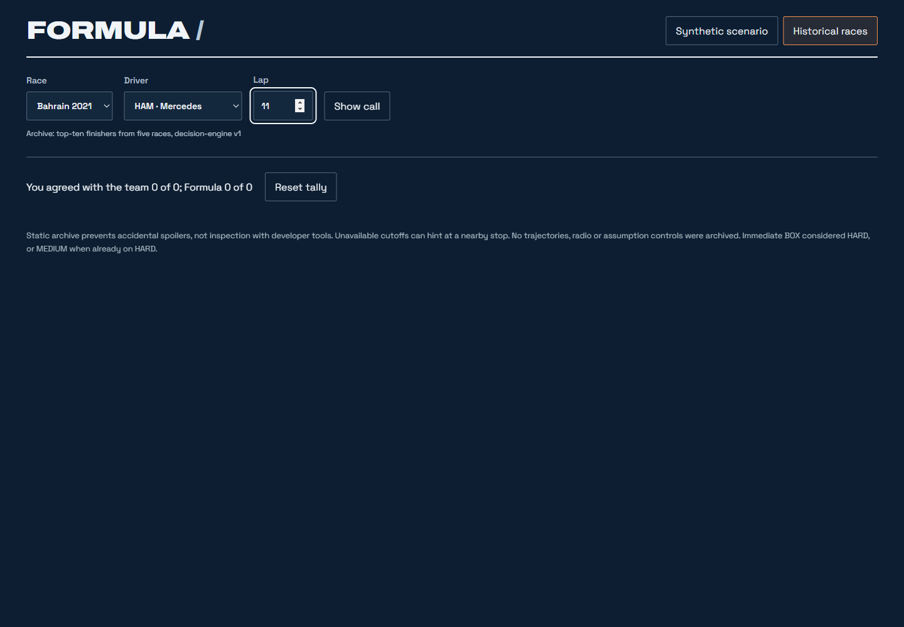
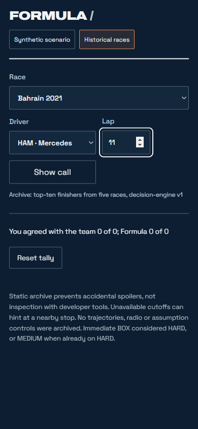
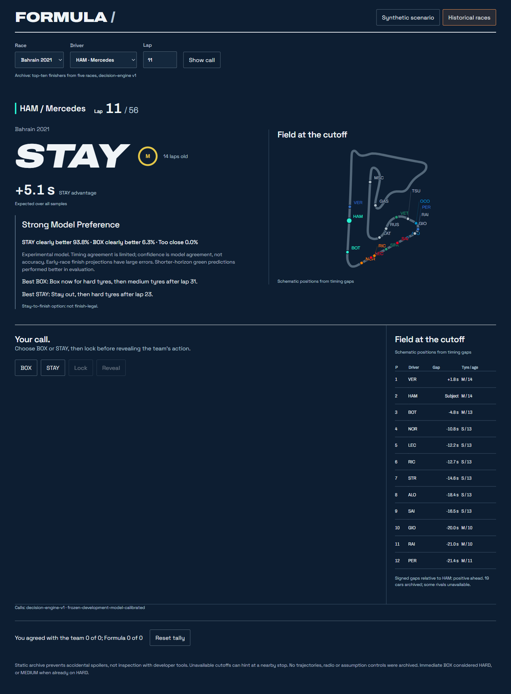
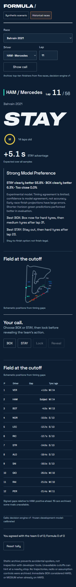
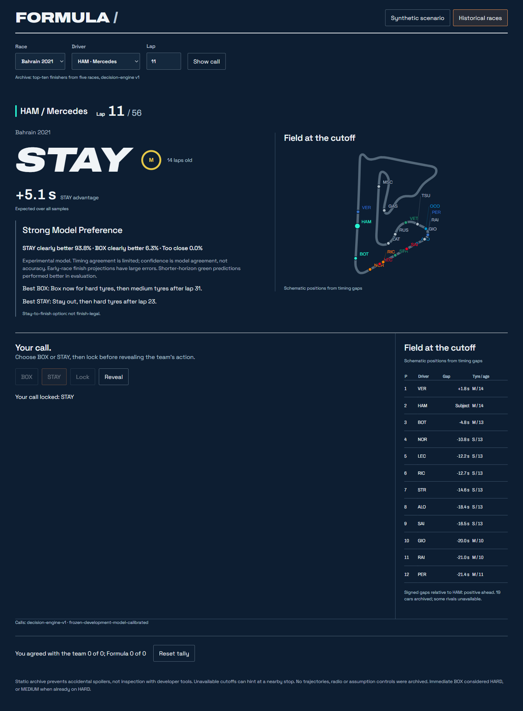
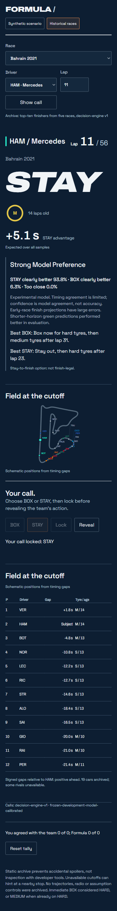
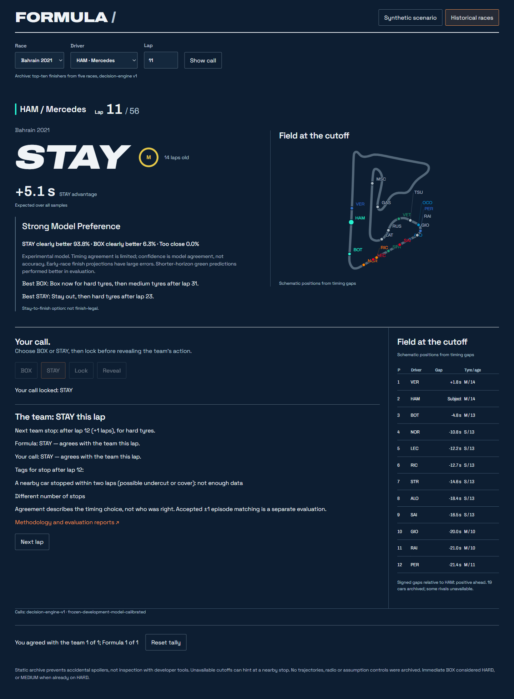
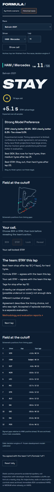

# Historical UI review

Implemented the two foundation fixes and historical playback on the existing pit-wall page. Playback uses only the saved 2,409 `decision-engine-v1` calls. No acquisition, engine execution, model/profile change, new evaluation or publication.

## Pointwise reveal correction

Outcome schema v2 uses `team_action_this_lap` (BOX only at an exactly equal stop boundary), `team_stop_this_lap`, and `next_team_stop` with signed `laps_from_cutoff`, or null. The headline and both tally comparisons use that exact action.

`near_miss` follows the requested condition: the Formula call differs this lap and a stop lies within one boundary lap. This includes an exact missed stop. A separate `near_miss_stop` identifies a nonzero adjacent boundary and is the only source of “Close: the team boxed one lap later/earlier”; an exact missed BOX has no direction note. Earlier neighbouring stops are retained for this note even though they are not future stops.

HAM / Bahrain 2021 / cutoff 11 now reveals **team STAY, Formula STAY agrees**, next stop **+1 lap, boundary 12, HARD** (physical entry lap 13). [Causal sample](../../static/historical/causal/bahrain_2021/44/11.json): 9,702 bytes; [outcome sample](../../static/historical/outcomes/bahrain_2021/44/11.json): 1,455 bytes.

All 2,409 causal bytes and the catalog are identical to the accepted foundation. The original `accepted_episode`, `accepted_episode_match` and `unmatched_alert_context` values were compared before replacement and are unchanged. Saved scored reports/audits remain hash-verified; there was no rematching. The accepted ±1 episode score is a separate [methodology reference](../evaluation/AGREEMENT_PLAN.md), not this interactive tally.

The foundation report's double-encoded dash and ± text are repaired. Strict UTF-8/mojibake checks cover all documentation Markdown, README, static JSON and report/HTML assets, design UI strings, Python UI sources and the final embedded document. JSON strings are checked after decoding escape sequences as well.

## Playback and state boundaries

- **Choosing:** race, archived driver, scheduled lap range 5 through scheduled laps minus 5. The catalog states the accepted top-ten cohort. No availability heatmap or result order. Missing cutoffs show only “No archived decision at this cutoff”.
- **Call shown:** causal driver/tyre/age, saved call/margin/confidence, fixed reliability note, best BOX/STAY policy sentences and schematic gap-based map/timing tower. Unsupported trajectories, radio and assumption sliders are absent in historical mode.
- **Call locked:** BOX/STAY is immutable; Reveal is enabled. No outcome fetch yet. Any selection change clears the choice, lock and reveal.
- **Revealed:** fetch only this record's outcome. Show exact team action, next stop/compound, Formula/user agreement, adjacent-boundary note and saved stop tags with unknown evidence labelled “not enough data”. Methodology and exact copies of the accepted evaluation reports become accessible here. No claim about the better strategy.

Next lap starts a fresh attempt. Session storage keeps only the tally and already-counted record IDs. The first revealed attempt at each snapshot counts once per browser session; a repeated Reveal or revisiting that snapshot cannot add another point. Reset clears the tally and current attempt. Pending fetches are aborted, and stale outcomes cannot update another selection or its tally.

The historical renderer is separate from the synthetic renderer. The synthetic JS/CSS and original fixture remain unchanged (Windows newline normalization only in the Git parity assertion). A mode round trip leaves the entire rendered synthetic workspace unchanged. The current design, fonts, call typography and panel layout are reused.

## Serving and limitations

Streamlit enables `server.enableStaticServing` in [config.toml](../../.streamlit/config.toml). Its embedded document resolves the same assets under `/app/static/`, including an optional Streamlit base path prefix. A normal static host serves [the page](../../design/pitwall-concept.html) with `../static/`. No endpoint or whole-race download exists. Only the selected causal record is fetched; the selected outcome is requested only by the locked Reveal handler. Catalog and pre-race track geometry are separate reference assets. The geometry copies are byte-identical to the accepted track assets.

This prevents accidental spoilers, not a determined user inspecting developer tools. An unavailable lap can hint at a nearby stop. Causal field omissions and schematic timing-gap placement are labelled. Immediate BOX still considers HARD, or MEDIUM when on HARD. Reliability wording and confidence thresholds are the approved fixed rules, without tuning.

All predictive source hashes remain strict. The exporter now records the approved static playback wrapper as a second operational source exception alongside the reservation guard; it is not a predictive model change. Accepted numerical artifacts, priors and profile remain unchanged. [UI audit manifest](manifest.json) records the relevant hashes and screenshots.

## Validation

| Check | Result |
| --- | --- |
| Full Python suite | 343 passed |
| Browser tests, including existing map tests | 12 passed |
| Saved-call/plan/state parity | All 2,409 records verified; engine/sampler/replay calls patched to fail |
| Causal-byte parity with accepted foundation | All 2,409 hashes identical |
| Exact stop-boundary and next-stop labels | All 2,409 checked against saved physical stops |
| Browser network boundary | Zero outcome requests in choosing, call shown and locked states; one selected request after Reveal |
| Browser reset/concurrency | Selection clears lock/reveal; delayed stale outcome discarded; disabled Reveal makes no request |
| Tally and navigation | Each snapshot counts once; repeat/revisit/reset/Next lap checked |
| Leakage | Poisoned outcome and future-row routes cannot change selected pre-reveal DOM/map |
| Static/Streamlit | Both exercised in Chrome; identical record paths and correct HAM reveal |
| Synthetic parity | Renderer/CSS/fixture unchanged and DOM identical after mode round trip |
| UTF-8 and report links | Strict decoding/no common double encoding; exact report copies and valid local links |
| Visual review | Desktop 1440×1000 and mobile 390×844; all four states inspected; no horizontal overflow |

Browser reproducibility: `node --test tests/browser/historical.test.cjs tests/browser/circuit-map.test.cjs`, with Playwright available via normal installation or `NODE_PATH`. Tests create and close local static/Streamlit servers. `CHROME_PATH` can select an installed browser. Screenshots are full-page captures; the timing tower scrolls to show the rest of the saved field.

## Export sizes

Per-record delivery stays unchanged. Updated outcome sizes reflect schema v2; no whole-race payload is requested.

| Race | Records | Causal bytes | Outcome bytes |
| --- | ---: | ---: | ---: |
| Bahrain 2021 | 429 | 4,089,698 | 452,554 |
| Spain 2022 | 542 | 5,180,688 | 650,398 |
| France 2022 | 429 | 4,120,739 | 378,259 |
| Spain 2023 | 550 | 5,446,907 | 571,108 |
| Bahrain 2024 | 459 | 4,536,147 | 488,323 |
| Total | 2,409 | 23,374,179 | 2,540,642 |

The additional playback JS is 14,060 bytes; scoped CSS is 2,538 bytes. The HAM sample requests a 9,702-byte causal record plus the 100,958-byte Bahrain geometry reference; its 1,455-byte outcome is loaded after Reveal. Sizes are uncompressed and exclude the original synthetic wrapper/fixture/fonts, catalog and browser cache effects.

## Screenshots: all four states

| State | Desktop | Mobile |
| --- | --- | --- |
| Choosing | [Desktop](screenshots/desktop-choosing.png) | [Mobile](screenshots/mobile-choosing.png) |
| Call shown | [Desktop](screenshots/desktop-call-shown.png) | [Mobile](screenshots/mobile-call-shown.png) |
| Call locked | [Desktop](screenshots/desktop-call-locked.png) | [Mobile](screenshots/mobile-call-locked.png) |
| Revealed | [Desktop](screenshots/desktop-revealed.png) | [Mobile](screenshots/mobile-revealed.png) |

### Choosing

### Call shown

### Call locked

### Revealed

[Additional Streamlit wrapper capture](screenshots/streamlit-desktop-revealed.png).

Stopped for review. Phase 6 is implemented and awaiting acceptance; decision engine v2 and all reserved races remain untouched.
