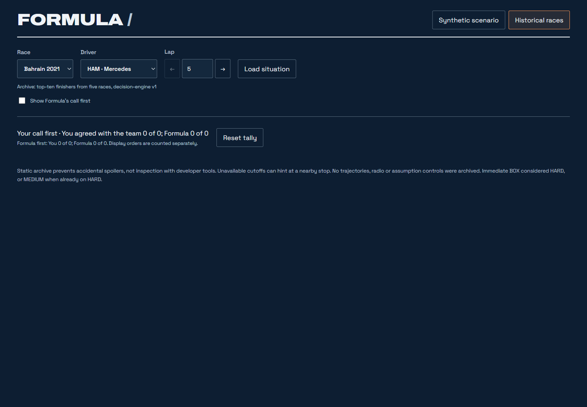
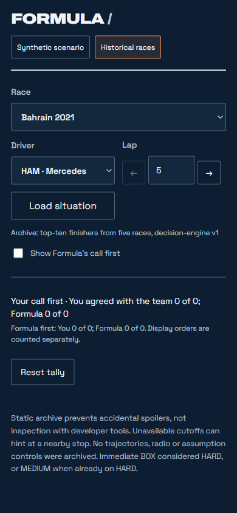
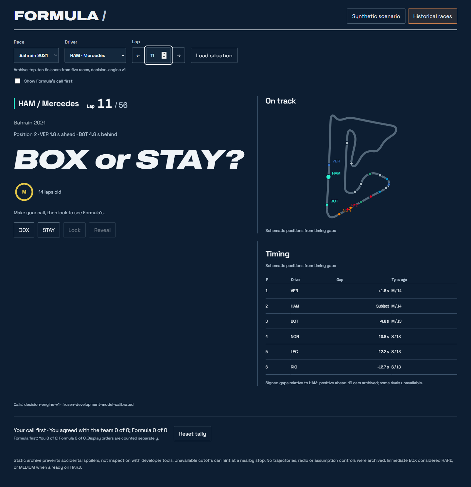
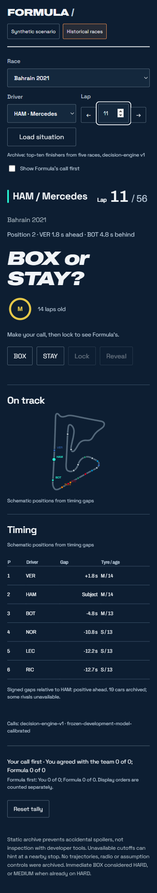
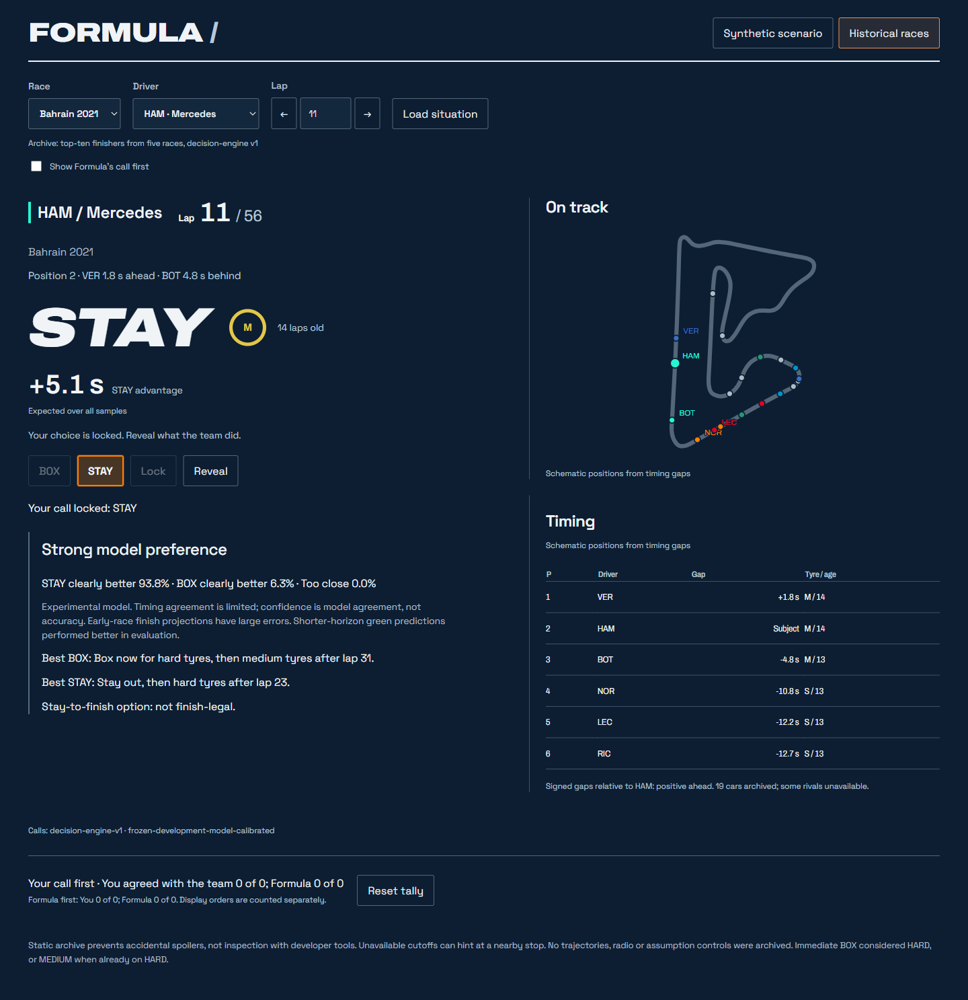
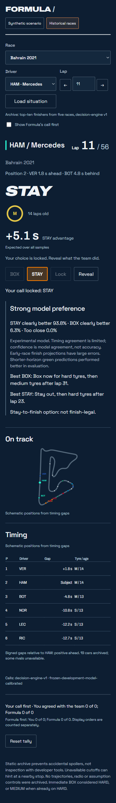
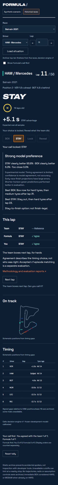

# Historical UX review

UI-only pass on the accepted historical foundation. No causal/outcome records, export manifest, engine, prediction profile, priors or evaluation scores changed. No engine runs or race acquisition. The existing synthetic renderer, styles and fixture remain unchanged.

## Order and tally

Default order is **your call → Lock shows Formula → Reveal shows the team**. Before Lock, the hero shows driver, lap, race, position, tyre/age and the nearest archived gap ahead/behind, with “BOX or STAY?” in the existing call typography. Formula's action, margin, confidence, reliability and best plans are not inserted into the historical DOM until Lock. Clearing or changing an attempt removes that model DOM again.

The unchecked-by-default “Show Formula's call first” toggle retains the previous order. Changing it starts a fresh attempt. Browser-session tally schema v2 keeps separate `user_first` and `formula_first` buckets, each with its own counts and already-scored record IDs. Each snapshot counts once **per display order** per session. Both modes' counts are shown with labels; earlier stored counts migrate into Formula first. Reset clears both buckets and the current attempt. This is browser-local interaction state, not an evaluation score.

The saved causal file still contains Formula's call and can be inspected in developer tools. The UX removes it from the pre-lock display and DOM; it does not claim to protect against determined inspection. Outcome requests remain gated by Lock plus explicit Reveal.

## Layout and reveal

- Controls sit directly under the situation in the left column. “On track” and “Timing” occupy the right column on desktop and follow the decision on mobile. The timing panel keeps the full archived field in a compact scroll area.
- Model preference uses sentence case: “Strong model preference”. BOX/STAY action labels and driver abbreviations keep their intended capitals. The selected choice has an accent outline and fill, including after Lock.
- Reveal uses three rows: **Team / Formula / You**. Team is the reference action; Formula and You show a check for agreement or a cross for disagreement at this exact lap. Agreement is not a claim about strategy quality.
- Next-stop copy reads “The team boxes next lap, for hards”, “The team boxes in 4 laps, for mediums”, or “No further stop”. A stop at the selected boundary is described as this lap. The existing signed distances and stop records are unchanged.
- Tags appear only when Formula differs this lap or the saved near-miss flag is true, under “Why Formula might have missed it”. Unknown evidence still reads “not enough data”. When Formula and the team agree, unrelated next-stop tags are omitted even if the user's choice differs.
- A next stop one lap away adds “The team boxes next lap. Can you call it?” beside Next lap. Previous/next arrows beside the lap field and direct lap typing load the selected situation immediately. The initial chooser retains a “Load situation” button; changing a lap needs no button press. Missing cutoffs retain the generic message, with no fallback or new engine call.
- Map text labels only the subject and up to three nearest archived cars on each side by signed timing gap. Every other car stays as a dot with its name/team in a native SVG tooltip. The existing causal positions and geometry are unchanged.

## Validation

| Check | Result |
| --- | --- |
| Full Python suite | 343 passed |
| Browser suite, including existing map checks | 18 passed |
| Pre-lock DOM | No Formula action, margin, confidence or plans in default mode; model DOM removed after selection changes |
| Two display orders | Default off; opt-in prior order; separate counts; toggle resets lock/reveal; legacy tally migration checked |
| Network boundary | No outcome request in choosing, situation shown or locked states; selected outcome only after Reveal |
| Existing behaviors | Selection reset, stale response protection, once-only scoring, reset, Next lap and synthetic DOM parity retained |
| Navigation | Arrows/direct typing load immediately; scheduled range respected; unavailable cutoff stays generic |
| Reveal | Three-row pointwise comparison, both near-miss directions, tag suppression and unknown evidence checked |
| Wording | Next-lap, multiple-lap, this-lap and no-further-stop cases checked |
| Map | Exact nearest-neighbour label set and tooltip for every saved car checked |
| Serving | Static host and Streamlit iframe exercised with the same record paths |
| Visual review | All states in both orders on desktop 1440×1000 and mobile 390×844; no horizontal overflow |
| Immutability | All 2,409 causal and 2,409 outcome files plus the export manifest unchanged from the start of this pass; frozen sources verified |

[UX audit manifest](manifest.json) records UI/screenshot hashes and the immutable-input comparison. The existing encoding checks continue to cover documentation, static JSON and UI text. The only changed file under `static/historical` is the **methodology HTML's UI wording** about display order and separate tallies; records, report copies and their scores are unchanged.

Browser reproduction: `node --test tests/browser/historical.test.cjs tests/browser/circuit-map.test.cjs`, with Playwright available through installation or `NODE_PATH`. Tests launch and close local static/Streamlit servers. `CHROME_PATH` can select an installed browser.

## Screenshots — default: your call first

The chooser is at the initial lap 5. The remaining captures use HAM / Bahrain 2021 / lap 11; both Formula and the team stay out, and the team boxes next lap for hards.

| State | Desktop | Mobile |
| --- | --- | --- |
| Choosing | [Desktop](screenshots/desktop-choosing.png) | [Mobile](screenshots/mobile-choosing.png) |
| Situation shown, before Lock | [Desktop](screenshots/desktop-call-shown.png) | [Mobile](screenshots/mobile-call-shown.png) |
| Locked: Formula shown | [Desktop](screenshots/desktop-call-locked.png) | [Mobile](screenshots/mobile-call-locked.png) |
| Revealed: team comparison | [Desktop](screenshots/desktop-revealed.png) | [Mobile](screenshots/mobile-revealed.png) |

### Choosing

### Situation shown

### Locked

### Revealed

## Screenshots — opt-in: Formula first

| State | Desktop | Mobile |
| --- | --- | --- |
| Choosing | [Desktop](screenshots/desktop-formula-first-choosing.png) | [Mobile](screenshots/mobile-formula-first-choosing.png) |
| Formula shown before Lock | [Desktop](screenshots/desktop-formula-first-call-shown.png) | [Mobile](screenshots/mobile-formula-first-call-shown.png) |
| Locked | [Desktop](screenshots/desktop-formula-first-call-locked.png) | [Mobile](screenshots/mobile-formula-first-call-locked.png) |
| Revealed | [Desktop](screenshots/desktop-formula-first-revealed.png) | [Mobile](screenshots/mobile-formula-first-revealed.png) |

[Additional Streamlit wrapper capture](screenshots/streamlit-desktop-revealed.png).

Stopped for review. The accepted records and scores remain the historical foundation; no model or evaluation work is part of this pass.
